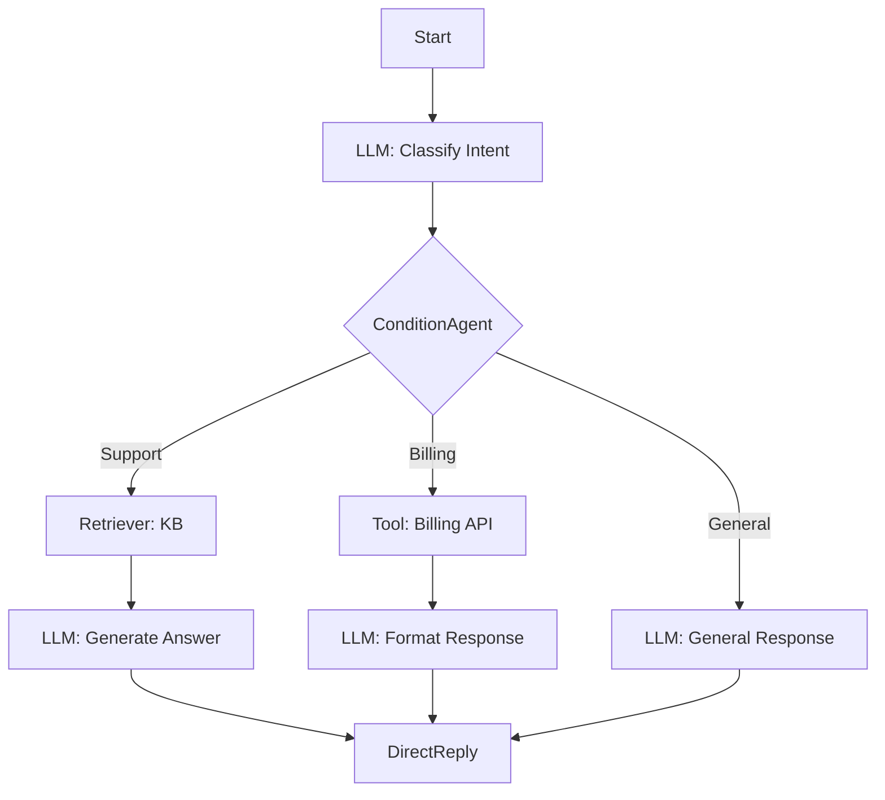

# Kodivian Agentflow Reference Guide

A comprehensive guide to Agentflow - the visual multi-agent workflow builder in the Kodivian platform.

---

## What is Agentflow?

**Agentflow** is a visual workflow designer that lets you build multi-step AI pipelines by connecting nodes together. Unlike traditional agents where the AI decides what to do, **you design the exact flow**.

### Agentflow vs Traditional Agents

| Aspect | Traditional Agents | Agentflow |
|--------|-------------------|-----------|
| **Flow Control** | AI decides | You design |
| **Predictability** | Variable | Deterministic |
| **Complexity** | Simple setup | Visual designer |
| **Debugging** | Hard to trace | Step-by-step visible |
| **Use Case** | Open-ended tasks | Structured workflows |

### Visual Example

```
┌─────────┐    ┌─────────┐    ┌───────────────┐    ┌─────────────┐
│  Start  │ →  │   LLM   │ →  │ ConditionAgent│ →  │ DirectReply │
└─────────┘    └─────────┘    └───────────────┘    └─────────────┘
                                      │
                                      ↓ If No
                              ┌─────────────┐
                              │    Tool     │ → Continue...
                              └─────────────┘
```

---

## Available Agentflow Nodes (15)

### Quick Reference

| Node | Category | Purpose |
|------|----------|---------|
| **Start** | Flow | Entry point, receives user input |
| **LLM** | AI | Call language model with prompts |
| **Agent** | AI | Kodivian tool-using agent |
| **Condition** | Logic | If/else branching (code-based) |
| **ConditionAgent** | Logic | AI-powered conditional routing |
| **Loop** | Logic | Repeat flow section |
| **Iteration** | Logic | Iterate over array items |
| **Tool** | Action | Execute a tool |
| **HTTP** | Action | Make HTTP requests |
| **Retriever** | Action | Search vector stores |
| **CustomFunction** | Action | Run JavaScript code |
| **HumanInput** | Interaction | Wait for user input |
| **DirectReply** | Flow | Return response to user |
| **ExecuteFlow** | Flow | Call another chatflow |
| **StickyNote** | Utility | Documentation/comments |

---

# Flow Control Nodes

## 1. Start Node
The entry point for every Agentflow.

| Output | Description |
|--------|-------------|
| question | User's input message |
| chatId | Unique conversation ID |
| sessionId | Session identifier |

**Every Agentflow must begin with a Start node.**

---

## 2. DirectReply Node
Returns a response to the user.

| Setting | Description |
|---------|-------------|
| Response | Text or variable to return |

**Use Cases**:
- End of workflow response
- Error messages
- Quick replies without LLM

---

## 3. ExecuteFlow Node
Calls another chatflow/agentflow.

| Setting | Description |
|---------|-------------|
| Chatflow | Select existing flow |
| Input | Data to pass |

**Use Cases**:
- Modular design
- Reusable sub-flows
- Separation of concerns

---

# AI Nodes

## 4. LLM Node
The core AI node - calls a language model.

| Setting | Description |
|---------|-------------|
| **Model** | Select chat model (GPT-4, Gemini, Claude, etc.) |
| **System Prompt** | Instructions for the AI |
| **Prompt** | User message template with variables |
| **Memory Type** | How to handle conversation history |
| **Structured Output** | Define JSON schema for output |
| **Update State** | Save values to flow state |

### Memory Types
| Type | Description |
|------|-------------|
| All Messages | Send complete history |
| Window Size | Last N messages only |
| Summary Buffer | Summarize old + keep recent |
| Empty | No history |

### Variables
Access variables using `{{ variable_name }}`:
```
Prompt: "Respond to: {{ $flow.question }}"
```

### State Variables
| Variable | Description |
|----------|-------------|
| `$flow.question` | User's input |
| `$flow.state.KEY` | Custom state values |
| `$flow.output` | Previous node output |
| `$vars.NAME` | Flow variables |

### Structured Output Example
```json
{
  "intent": "string - The user's intent",
  "entities": "array - Extracted entities",
  "confidence": "number - Confidence score 0-1"
}
```

---

## 5. Agent Node
Embeds a full kodivian agent within the flow.

| Setting | Description |
|---------|-------------|
| Agent Type | Tool Agent, ReAct, etc. |
| Chat Model | LLM for agent |
| Tools | Available tools |
| System Message | Agent instructions |
| Max Iterations | Limit tool calls |

**Use Cases**:
- Complex sub-tasks requiring tool use
- Research tasks within a larger workflow
- Dynamic decision making in specific steps

---

# Logic Nodes

## 6. Condition Node
Code-based if/else branching.

| Setting | Description |
|---------|-------------|
| JavaScript | Code returning true/false |

**Example**:
```javascript
// Route based on sentiment
const output = $flow.output;
return output.sentiment === 'positive';
```

**Outputs**:
- ✅ True path
- ❌ False path

---

## 7. ConditionAgent Node
AI-powered conditional routing - the LLM decides which path to take.

| Setting | Description |
|---------|-------------|
| **Model** | Chat model for decision |
| **Condition Prompt** | Describe the conditions |
| **Scenarios** | Define output paths |
| **Memory Type** | Conversation context |

### How It Works
```
Input: User message or previous output
         ↓
LLM analyzes based on prompt
         ↓
Routes to appropriate scenario branch
```

### Scenario Example
```
Scenario 1: "User wants technical support"
Scenario 2: "User wants billing help"  
Scenario 3: "User wants general information"
```

**Best For**: Intent routing, dynamic classification

---

## 8. Loop Node
Repeats a section of the flow.

| Setting | Description |
|---------|-------------|
| Max Iterations | Maximum loop count |
| Continue Condition | When to continue looping |

**Use Cases**:
- Retry logic
- Iterative refinement
- Multi-turn processing

---

## 9. Iteration Node
Iterates over an array, running the flow for each item.

| Setting | Description |
|---------|-------------|
| Array | Array to iterate over |
| Item Variable | Name for current item |

**Example**:
```
Input: ["doc1", "doc2", "doc3"]
         ↓
Process each document → Combine results
```

---

# Action Nodes

## 10. Tool Node
Executes a tool from the tools library.

| Setting | Description |
|---------|-------------|
| Tool | Select from available tools |
| Tool Input | Data to pass to tool |

**Available Tools**: All tools from TOOLS_REFERENCE_GUIDE.md
- Web Search (Serper, Tavily, etc.)
- Gmail, Calendar, Sheets
- HTTP Requests
- Calculator, etc.

---

## 11. HTTP Node
Makes HTTP API requests.

| Setting | Description |
|---------|-------------|
| Method | GET, POST, PUT, DELETE |
| URL | Endpoint URL (supports variables) |
| Headers | Request headers (JSON) |
| Body | Request body (JSON) |

**Example**:
```
URL: https://api.example.com/users/{{ $flow.userId }}
Method: GET
Headers: { "Authorization": "Bearer {{ $vars.API_KEY }}" }
```

---

## 12. Retriever Node
Searches vector stores for relevant documents.

| Setting | Description |
|---------|-------------|
| Vector Store | Connected vector store |
| Query | Search query (supports variables) |
| Top K | Number of results |

**Use Cases**:
- RAG within workflows
- Knowledge base lookup
- Context enrichment

---

## 13. CustomFunction Node
Run custom JavaScript code.

| Setting | Description |
|---------|-------------|
| JavaScript | Your custom code |

**Example**:
```javascript
// Transform the data
const input = $flow.output;
const result = {
  summary: input.text.substring(0, 100),
  wordCount: input.text.split(' ').length,
  processed: true
};
return result;
```

**Available Variables**:
- `$flow` - Flow state and data
- `$vars` - Flow variables
- Node outputs from previous steps

---

# Interaction Nodes

## 14. HumanInput Node
Pauses the flow and waits for user input.

| Setting | Description |
|---------|-------------|
| Message | Prompt shown to user |
| Input Type | text, select, confirm |

**Use Cases**:
- Confirmation steps ("Are you sure?")
- Collecting additional info
- Multi-step forms
- Human-in-the-loop approval

---

## 15. StickyNote Node
Documentation node - doesn't affect flow execution.

| Setting | Description |
|---------|-------------|
| Note Text | Documentation content |
| Color | Note color for organization |

**Use Cases**:
- Document flow sections
- Leave notes for team
- Explain complex logic

---

# Flow State & Variables

## Accessing Data

| Syntax | Description | Example |
|--------|-------------|---------|
| `$flow.question` | Original user input | "What is the weather?" |
| `$flow.chatId` | Conversation ID | "abc123" |
| `$flow.sessionId` | Session ID | "session456" |
| `$flow.output` | Previous node output | { text: "..." } |
| `$flow.state.KEY` | Custom state values | $flow.state.intent |
| `$vars.NAME` | Flow variables | $vars.API_KEY |

## Setting State
In LLM Node, use "Update State" to save values:
```
Key: intent
Value: {{ output.intent }}
```

Then access later: `$flow.state.intent`

---

# Common Patterns

## 1. Intent Routing

```
Start → LLM (classify intent) → ConditionAgent → Branch by intent
```

## 2. RAG with Fallback

```
Start → Retriever → Condition (docs found?)
    ├── Yes → LLM (with context)
    └── No → LLM (general response)
```

## 3. Multi-Step Processing

```
Start → LLM (extract data) → Tool (API call) → LLM (format response) → DirectReply
```

## 4. Human Approval

```
Start → LLM (generate proposal) → HumanInput (approve?) 
    ├── Approved → Tool (execute action)
    └── Rejected → DirectReply (cancelled)
```

## 5. Iterative Refinement

```
Start → LLM (draft) → Loop → LLM (refine) → Condition (good enough?) 
    ├── Yes → DirectReply
    └── No → Continue loop
```

---

# Best Practices

## 1. Design Principles

| Principle | Description |
|-----------|-------------|
| **Start Simple** | Begin with linear flows, add complexity |
| **Test Each Node** | Verify each step works before connecting |
| **Use State** | Pass data via state, not prompts |
| **Document** | Add StickyNotes for complex logic |

## 2. Error Handling

- Add Condition nodes after API calls to handle failures
- Use HumanInput for critical approvals
- Set reasonable Max Iterations on loops

## 3. Performance

- Use appropriate Memory Type (Window Size for long conversations)
- Minimize unnecessary LLM calls
- Cache frequently used data in state

## 4. Debugging

- Check node outputs in the flow execution logs
- Use DirectReply nodes for debugging mid-flow
- Test with simple inputs first

---

# Integration Flow


