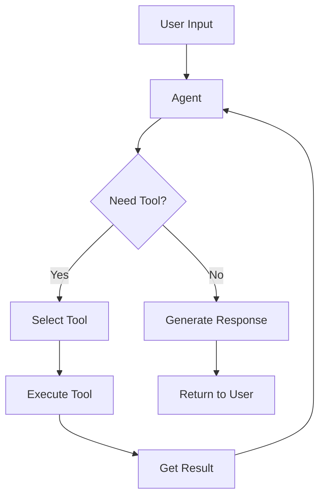
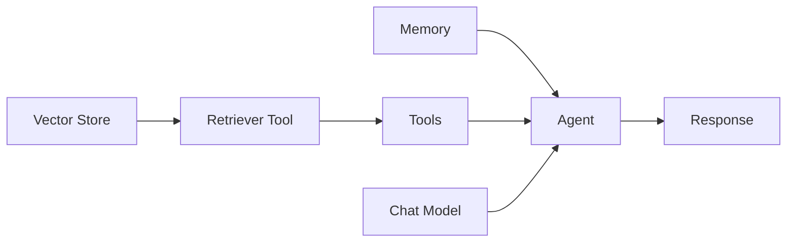

# Autonomous Agents Reference Guide

A comprehensive guide to all agent types in the Autonomous platform. Agents combine LLMs with tools to autonomously complete tasks.

---

## What are Agents?

**Agents** are autonomous systems that use LLMs to decide which actions (tools) to take to accomplish a goal.

### How Agents Work

```
User: "Book a flight to Paris for next Monday"
         ↓
Agent (LLM): Thinks... "I need to search for flights"
         ↓
Action: Use Flight Search Tool → Results
         ↓
Agent (LLM): Thinks... "Found options, need to book"
         ↓
Action: Use Booking Tool → Confirmation
         ↓
Agent: "I've booked your flight to Paris..."
```

### Agent vs Chain

| Aspect | Chain | Agent |
|--------|-------|-------|
| **Flow** | Fixed sequence | Dynamic decisions |
| **Tools** | Predefined steps | Chooses tools at runtime |
| **Flexibility** | Low | High |
| **Complexity** | Simple | Complex |
| **Use Case** | Predictable tasks | Open-ended tasks |

---

## Quick Decision Matrix

| Agent Type | Best For | Tools Support | Memory |
|------------|----------|---------------|--------|
| **Tool Agent** | General tool use | ✅ Any tools | ✅ |
| **OpenAI Assistant** | OpenAI ecosystem | ✅ OpenAI tools | ✅ |
| **ReAct Agent (Chat)** | Reasoning + Acting | ✅ Any tools | ✅ |
| **ReAct Agent (LLM)** | Legacy LLM models | ✅ Any tools | ✅ |
| **Conversational Agent** | Chat with tools | ✅ Any tools | ✅ |
| **CSV Agent** | CSV data analysis | Built-in | ❌ |
| **Airtable Agent** | Airtable queries | Built-in | ❌ |
| **XML Agent** | XML response format | ✅ Any tools | ✅ |

---

## Available Agents (9)

# General Purpose Agents

## 1. Tool Agent
The most flexible agent - uses any tools with any chat model.

| Setting | Description |
|---------|-------------|
| Chat Model | Any chat model |
| Tools | Array of tools |
| Memory | Optional conversation memory |
| System Message | Agent instructions |
| Max Iterations | Limit tool calls |

**How It Works**:
```
1. Receive user input
2. LLM decides which tool to use (or respond directly)
3. Execute tool, get result
4. LLM processes result
5. Repeat until task complete
```

**Best For**: General-purpose automation with custom tools

---

## 2. OpenAI Assistant
Uses OpenAI's Assistants API with built-in features.

| Setting | Description |
|---------|-------------|
| Credential | `openAIApi` |
| Assistant ID | OpenAI Assistant ID |

**OR Create New**:
| Setting | Description |
|---------|-------------|
| Assistant Name | Display name |
| Instructions | System prompt |
| Model | GPT-4, GPT-3.5, etc. |
| Tools | OpenAI tools or custom |

**Built-in Features**:
- Code Interpreter
- File Search (retrieval)
- Function calling
- Persistent threads

**Best For**: OpenAI-native applications, file handling

---

## 3. ReAct Agent (Chat)
Reasoning + Acting pattern with chat models.

| Setting | Description |
|---------|-------------|
| Chat Model | Any chat model |
| Tools | Array of tools |
| Memory | Optional conversation memory |
| System Message | Agent instructions |
| Max Iterations | Limit reasoning loops |

**ReAct Pattern**:
```
Thought: I need to search for information about X
Action: search_tool
Action Input: "X information"
Observation: [search results]
Thought: Now I have the information, I can answer
Final Answer: Based on my search...
```

**Best For**: Complex reasoning tasks, transparent decision-making

---

## 4. ReAct Agent (LLM)
ReAct pattern for legacy LLM (non-chat) models.

| Setting | Description |
|---------|-------------|
| LLM | Text completion model |
| Tools | Array of tools |
| Memory | Optional memory |

**Best For**: Legacy integrations, text completion models

---

## 5. Conversational Agent
Optimized for back-and-forth conversation with tools.

| Setting | Description |
|---------|-------------|
| Chat Model | Any chat model |
| Tools | Array of tools |
| Memory | Conversation memory |
| System Message | Agent personality |

**Best For**: Chatbots that need to take actions

---

## 6. Conversational Retrieval Tool Agent
Combines retrieval with conversational tool use.

| Setting | Description |
|---------|-------------|
| Chat Model | Any chat model |
| Tools | Array of tools |
| Memory | Conversation memory |
| Retriever | Vector store retriever |

**Best For**: RAG + actions in one agent

---

## 7. XML Agent
Uses XML format for tool calls (better for some models).

| Setting | Description |
|---------|-------------|
| Chat Model | Any chat model |
| Tools | Array of tools |
| Memory | Optional memory |

**Response Format**:
```xml
<tool>search_tool</tool>
<tool_input>query here</tool_input>
```

**Best For**: Models that handle XML better than JSON

---

# Data-Specific Agents

## 8. CSV Agent
Query CSV files using natural language.

| Setting | Description |
|---------|-------------|
| LLM | Language model |
| CSV File | Upload CSV |

**Example**:
```
User: "What's the average sales in Q3?"
Agent: Analyzes CSV → "The average sales in Q3 was $45,230"
```

**Best For**: Data analysis without coding

---

## 9. Airtable Agent
Query Airtable bases with natural language.

| Setting | Description |
|---------|-------------|
| LLM | Language model |
| Credential | `airtableApi` |
| Base ID | Airtable base |
| Table ID | Target table |

**Example**:
```
User: "How many tasks are overdue?"
Agent: Queries Airtable → "There are 5 overdue tasks"
```

**Best For**: Airtable data queries

---

# Agent Architecture

## Agent Execution Loop



## Agent Components

| Component | Purpose |
|-----------|---------|
| **LLM/Chat Model** | Decision making |
| **Tools** | Actions to take |
| **Memory** | Conversation context |
| **System Message** | Instructions/personality |
| **Max Iterations** | Prevent infinite loops |

---

# Feature Comparison

| Feature | Tool Agent | OpenAI Asst | ReAct | CSV Agent |
|---------|------------|-------------|-------|-----------|
| **Any LLM** | ✅ | ❌ OpenAI only | ✅ | ✅ |
| **Custom Tools** | ✅ | ✅ | ✅ | ❌ |
| **Memory** | ✅ | ✅ Built-in | ✅ | ❌ |
| **File Handling** | Via tools | ✅ Built-in | Via tools | CSV only |
| **Streaming** | ✅ | ✅ | ✅ | ❌ |
| **Reasoning Trace** | ❌ | ❌ | ✅ | ❌ |

---

# Best Practices

## 1. Choosing an Agent

| Need | Recommendation |
|------|----------------|
| General automation | Tool Agent |
| OpenAI with files | OpenAI Assistant |
| Transparent reasoning | ReAct Agent |
| Simple chatbot + tools | Conversational Agent |
| CSV analysis | CSV Agent |

## 2. Tool Design for Agents

```javascript
// Good: Clear, specific description
{
  name: "get_weather",
  description: "Get current weather for a city. Returns temperature in Celsius and conditions.",
  parameters: {
    city: { type: "string", description: "City name, e.g., 'Paris'" }
  }
}

// Bad: Vague description
{
  name: "tool1", 
  description: "gets stuff"
}
```

## 3. System Message Guidelines

- Be specific about agent's role
- List available capabilities
- Define response format if needed
- Include constraints and limitations

**Example**:
```
You are a travel assistant that helps users plan trips.
You can:
- Search for flights and hotels
- Get weather information
- Create itineraries

Always confirm prices before booking.
Do not book anything without explicit user approval.
```

## 4. Max Iterations

| Task Type | Recommended |
|-----------|-------------|
| Simple queries | 3-5 |
| Multi-step tasks | 10-15 |
| Complex research | 20+ |

## 5. Error Handling

- Set reasonable max iterations
- Provide fallback responses
- Log tool failures
- Handle rate limits gracefully

---

# Integration with Other Components



## Common Tool Combinations

| Use Case | Tools |
|----------|-------|
| Research Assistant | Web Search + Calculator |
| Customer Support | Knowledge Base + Ticket System |
| Data Analyst | CSV Reader + Calculator + Charts |
| Travel Agent | Flight API + Hotel API + Weather |
| Dev Assistant | GitHub + Code Interpreter + Docs |
