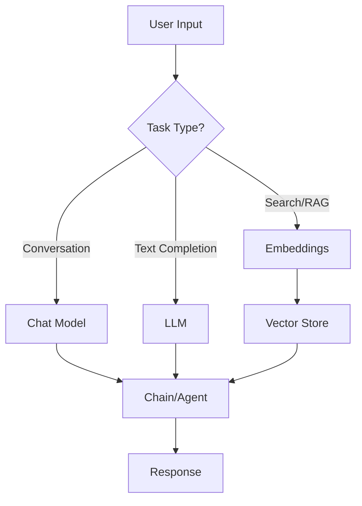

# Autonomous Models Reference Guide

A comprehensive guide to LLMs, Chat Models, and Embeddings in the Autonomous platform.

---

## What are LLMs, Chat Models, and Embeddings?

### LLM (Large Language Model)
**Text completion models** that take a prompt and generate text continuation.

```
Input:  "The capital of France is"
Output: "Paris, which is known for the Eiffel Tower..."
```

### Chat Model
**Conversational models** optimized for back-and-forth dialogue with role-based messages.

```
Input:  [System: "You are a helpful assistant", User: "What is 2+2?"]
Output: [Assistant: "2+2 equals 4"]
```

### Embeddings
**Vector representations** that convert text into numbers for similarity search.

```
Input:  "Hello world"
Output: [0.023, -0.045, 0.089, ..., 0.012]  (1536 dimensions)
```

---

## LLM vs Chat Model vs Embeddings

| Aspect | LLM | Chat Model | Embeddings |
|--------|-----|------------|------------|
| **Purpose** | Text completion | Conversation | Vector search |
| **Input** | Single prompt | Message array | Text |
| **Output** | Text | Message | Vector array |
| **Use Case** | Completion, generation | Chatbots, agents | RAG, similarity |
| **Stateful** | ❌ | ❌ (needs memory) | N/A |

### When to Use Which?

| Scenario | Use |
|----------|-----|
| Building a chatbot | **Chat Model** |
| Text completion API | **LLM** |
| Document search/RAG | **Embeddings** |
| Agents with tools | **Chat Model** |
| Legacy integrations | **LLM** |

---

# Part 1: Chat Models

## Quick Decision Matrix

| Provider | Best For | Self-Hosted | Vision | Tool Calling |
|----------|----------|-------------|--------|--------------|
| **OpenAI** | General purpose, best ecosystem | ❌ | ✅ | ✅ |
| **Google Gemini** | Long context, multimodal | ❌ | ✅ | ✅ |
| **Anthropic Claude** | Safety, reasoning, long context | ❌ | ✅ | ✅ |
| **Azure OpenAI** | Enterprise, compliance | ❌ | ✅ | ✅ |
| **AWS Bedrock** | AWS integration | ❌ | Varies | ✅ |
| **Ollama** | Local/private, free | ✅ | ✅ | ✅ |
| **Mistral** | European, efficient | ❌ | ❌ | ✅ |
| **Cohere** | Enterprise, RAG-focused | ❌ | ❌ | ✅ |
| **Groq** | Speed (fastest inference) | ❌ | ❌ | ✅ |
| **DeepSeek** | Coding, reasoning | ❌ | ❌ | ✅ |

---

## Available Chat Models (28)

### Major Cloud Providers

#### 1. ChatOpenAI
| Setting | Description | Default |
|---------|-------------|---------|
| Model Name | gpt-4o, gpt-4o-mini, gpt-4-turbo, etc. | gpt-4o-mini |
| Temperature | Creativity (0=focused, 1=creative) | 0.9 |
| Max Tokens | Maximum response length | Auto |
| Streaming | Stream responses | ✅ |
| Image Uploads | Enable vision | ❌ |
| JSON Mode | Structured output | ❌ |
| Image Resolution | low/high/auto | low |

**Credential**: `openAIApi` (API Key)

---

#### 2. ChatGoogleGenerativeAI (Gemini)
| Setting | Description | Default |
|---------|-------------|---------|
| Model Name | gemini-2.5-pro, gemini-2.0-flash, etc. | gemini-2.0-flash |
| Temperature | Creativity | 0.9 |
| Max Tokens | Maximum response length | Auto |
| Top P | Nucleus sampling | - |
| Top K | Top-k sampling | - |
| Streaming | Stream responses | ✅ |
| Image Uploads | Enable vision | ❌ |
| Safety Settings | Content filtering | Configurable |

**Credential**: `googleGenerativeAI` (API Key)

**Special Features**:
- Harm category filtering (harassment, hate, sexual, dangerous)
- Block thresholds (low, medium, high, none)
- Context caching support

---

#### 3. ChatAnthropic (Claude)
| Setting | Description | Default |
|---------|-------------|---------|
| Model Name | claude-3-opus, claude-3-sonnet, claude-3-haiku | claude-3-haiku |
| Temperature | Creativity | 0.9 |
| Max Tokens | Maximum response length | Auto |
| Top P | Nucleus sampling | - |
| Top K | Top-k sampling | - |
| Streaming | Stream responses | ✅ |
| Image Uploads | Enable vision | ❌ |
| Extended Thinking | Deep reasoning mode | ❌ |
| Budget Tokens | Thinking token limit | 1024 |

**Credential**: `anthropicApi` (API Key)

**Special Features**:
- Extended thinking for complex reasoning (Claude 3.5 Sonnet, Claude 4)
- 200K context window

---

#### 4. AzureChatOpenAI
| Setting | Description | Default |
|---------|-------------|---------|
| Model Name | Deployment name | gpt-4o |
| Temperature | Creativity | 0.9 |
| Max Tokens | Maximum response length | Auto |
| Streaming | Stream responses | ✅ |
| Image Uploads | Enable vision | ❌ |

**Credential**: `azureOpenAIApi` (Endpoint + API Key + Deployment)

**Best For**: Enterprise with Azure compliance requirements

---

#### 5. AWS Bedrock Chat
| Setting | Description | Default |
|---------|-------------|---------|
| Region | AWS region | us-east-1 |
| Model | anthropic.claude-3, amazon.titan, etc. | anthropic.claude-3-haiku |
| Temperature | Creativity | 0.7 |
| Max Tokens | Maximum response length | Auto |
| Streaming | Stream responses | ✅ |

**Credential**: `awsApi` (Access Key + Secret Key)

**Available Models**:
- Anthropic Claude (3, 3.5)
- Amazon Titan
- Meta Llama
- Mistral
- Cohere Command

---

### Specialized Providers

#### 6. ChatMistral
| Setting | Description | Default |
|---------|-------------|---------|
| Model Name | mistral-large, mistral-medium, mistral-small | mistral-small |
| Temperature | Creativity | 0.9 |
| Max Tokens | Maximum response length | Auto |
| Top P | Nucleus sampling | - |
| Streaming | Stream responses | ✅ |
| JSON Mode | Structured output | ❌ |
| Safe Prompt | Content safety | ❌ |

**Credential**: `mistralAIApi` (API Key)

---

#### 7. ChatCohere
| Setting | Description | Default |
|---------|-------------|---------|
| Model Name | command-r-plus, command-r, command | command |
| Temperature | Creativity | 0.3 |
| Max Tokens | Maximum response length | Auto |
| Streaming | Stream responses | ✅ |

**Credential**: `cohereApi` (API Key)

**Best For**: RAG applications, enterprise search

---

#### 8. Groq
| Setting | Description | Default |
|---------|-------------|---------|
| Model Name | llama3-70b, mixtral-8x7b, gemma-7b | mixtral-8x7b-32768 |
| Temperature | Creativity | 0.9 |
| Max Tokens | Maximum response length | Auto |
| Streaming | Stream responses | ✅ |

**Credential**: `groqApi` (API Key)

**Best For**: **Fastest inference** (100+ tokens/sec)

---

#### 9. DeepSeek
| Setting | Description | Default |
|---------|-------------|---------|
| Model Name | deepseek-chat, deepseek-coder | deepseek-chat |
| Temperature | Creativity | 0.9 |
| Max Tokens | Maximum response length | Auto |
| Streaming | Stream responses | ✅ |

**Credential**: `deepseekApi` (API Key)

**Best For**: Coding tasks, mathematical reasoning

---

### Self-Hosted Options

#### 10. ChatOllama
| Setting | Description | Default |
|---------|-------------|---------|
| Base URL | Ollama server URL | http://localhost:11434 |
| Model Name | llama3, mistral, codellama, etc. | llama3 |
| Temperature | Creativity | 0.9 |
| Top P | Nucleus sampling | - |
| Top K | Top-k sampling | - |
| Num GPU | GPU layers | - |
| Keep Alive | Model in memory | 5m |
| Image Uploads | Enable vision | ❌ |
| JSON Mode | Structured output | ❌ |

**Credential**: None required (local)

**Best For**: Privacy, offline use, experimentation

---

#### 11. ChatLocalAI
| Setting | Description | Default |
|---------|-------------|---------|
| Base Path | LocalAI server URL | http://localhost:8080/v1 |
| Model Name | Your model name | gpt-3.5-turbo |
| Temperature | Creativity | 0.9 |

**Credential**: `localAIApi` (optional API Key)

**Best For**: Self-hosted OpenAI-compatible API

---

### Other Providers

| Provider | Models | Best For |
|----------|--------|----------|
| **ChatFireworks** | Llama, Mistral, Qwen | Fast open-source models |
| **ChatTogetherAI** | 50+ models | Model variety |
| **ChatPerplexity** | pplx-online, sonar | Web search integration |
| **ChatXAI** | Grok | Real-time knowledge |
| **ChatNvdiaNIM** | Llama, Mixtral | NVIDIA infrastructure |
| **ChatSambanova** | Custom chips | Enterprise speed |
| **ChatHuggingFace** | Any HF model | Custom models |
| **ChatOpenRouter** | 100+ models | Model aggregator |
| **ChatCerebras** | Custom hardware | Enterprise speed |
| **ChatIBMWatsonx** | IBM models | Enterprise AI |

---

## Common Chat Model Settings

### Temperature
Controls randomness/creativity:
- **0.0**: Deterministic, focused (good for factual tasks)
- **0.5**: Balanced
- **1.0**: Creative, varied (good for brainstorming)
- **>1.0**: Very random (usually not recommended)

### Max Tokens
Limits response length:
- Not set: Model decides
- Set low (100-500): Short responses
- Set high (2000+): Long-form content

### Top P (Nucleus Sampling)
Alternative to temperature:
- **0.1**: Very focused (only top 10% probability tokens)
- **0.9**: Diverse (top 90% probability tokens)
- Use Top P OR Temperature, not both

### Streaming
- **Enabled**: Tokens appear as generated (better UX)
- **Disabled**: Full response at once (simpler handling)

---

# Part 2: LLMs (Text Completion)

## Available LLMs (12)

| Provider | Use Case |
|----------|----------|
| **OpenAI** | GPT-3.5-turbo-instruct, text-davinci |
| **Azure OpenAI** | Enterprise text completion |
| **AWS Bedrock** | Titan, Cohere, AI21 |
| **Google Vertex AI** | PaLM, text-bison |
| **Cohere** | command, command-light |
| **Ollama** | Local text models |
| **HuggingFace** | Any HF text model |
| **Replicate** | Cloud model hosting |
| **TogetherAI** | Open-source models |
| **Fireworks** | Fast inference |
| **SambaNova** | Enterprise |
| **IBM Watsonx** | Enterprise |

> **Note**: Most modern applications use **Chat Models** instead of LLMs. LLMs are primarily for legacy integrations or specific completion tasks.

---

# Part 3: Embeddings

## Quick Decision Matrix

| Provider | Best For | Dimensions | Cost |
|----------|----------|------------|------|
| **OpenAI** | General purpose | 1536/3072 | $$ |
| **Google** | Multimodal | 768 | $$ |
| **Cohere** | Multilingual | 1024 | $$ |
| **Voyage AI** | Code, legal, finance | 1024 | $$ |
| **Jina AI** | Long context | 768 | $$ |
| **Mistral** | European | 1024 | $$ |
| **Ollama** | Local/free | Varies | Free |
| **HuggingFace** | Custom models | Varies | Free/$ |

---

## Available Embeddings (15)

### 1. OpenAI Embeddings
| Setting | Description | Default |
|---------|-------------|---------|
| Model Name | text-embedding-3-small/large, ada-002 | text-embedding-ada-002 |
| Dimensions | Vector size (3-small: 512-1536) | 1536 |
| Batch Size | Texts per API call | Auto |
| Strip New Lines | Remove line breaks | ❌ |

**Credential**: `openAIApi` (API Key)

**Models**:
- `text-embedding-3-small`: Faster, cheaper, good quality
- `text-embedding-3-large`: Best quality (up to 3072 dims)
- `text-embedding-ada-002`: Legacy, still popular

---

### 2. Google Generative AI Embeddings
| Setting | Description | Default |
|---------|-------------|---------|
| Model Name | text-embedding-004, embedding-001 | text-embedding-004 |
| Task Type | retrieval_document, retrieval_query, etc. | - |

**Credential**: `googleGenerativeAI` (API Key)

**Task Types**:
- `retrieval_document`: For storing documents
- `retrieval_query`: For search queries
- `semantic_similarity`: For comparing texts
- `classification`: For categorization

---

### 3. Azure OpenAI Embeddings
| Setting | Description | Default |
|---------|-------------|---------|
| Model Name | Deployment name | text-embedding-ada-002 |
| Batch Size | Texts per API call | Auto |

**Credential**: `azureOpenAIApi` (Endpoint + API Key)

---

### 4. AWS Bedrock Embeddings
| Setting | Description | Default |
|---------|-------------|---------|
| Region | AWS region | us-east-1 |
| Model | amazon.titan-embed, cohere.embed | amazon.titan-embed-text-v1 |

**Credential**: `awsApi` (Access Key + Secret)

---

### 5. Cohere Embeddings
| Setting | Description | Default |
|---------|-------------|---------|
| Model Name | embed-english-v3.0, embed-multilingual | embed-english-v3.0 |
| Input Type | search_document, search_query, etc. | search_document |

**Credential**: `cohereApi` (API Key)

**Best For**: Multilingual applications

---

### 6. Voyage AI Embeddings
| Setting | Description | Default |
|---------|-------------|---------|
| Model Name | voyage-large-2, voyage-code-2, etc. | voyage-2 |

**Credential**: `voyageAIApi` (API Key)

**Specialized Models**:
- `voyage-code-2`: Code search
- `voyage-law-2`: Legal documents
- `voyage-finance-2`: Financial documents

---

### 7. Ollama Embeddings
| Setting | Description | Default |
|---------|-------------|---------|
| Base URL | Ollama server | http://localhost:11434 |
| Model Name | nomic-embed-text, mxbai-embed-large | nomic-embed-text |

**Credential**: None (local)

**Best For**: Free, private, local embeddings

---

### 8. Mistral Embeddings
| Setting | Description | Default |
|---------|-------------|---------|
| Model | mistral-embed | mistral-embed |
| Batch Size | Texts per API call | Auto |

**Credential**: `mistralAIApi` (API Key)

---

### 9. Jina AI Embeddings
| Setting | Description | Default |
|---------|-------------|---------|
| Model | jina-embeddings-v2-base-en | jina-embeddings-v2-base-en |

**Credential**: `jinaAIApi` (API Key)

**Best For**: Long documents (8K token context)

---

## Embedding Dimensions Guide

| Dimensions | Storage | Speed | Quality |
|------------|---------|-------|---------|
| 256-512 | Small | Fast | Good |
| 768-1024 | Medium | Medium | Better |
| 1536+ | Large | Slower | Best |

**Tip**: OpenAI `text-embedding-3-small` allows custom dimensions (256-1536) for cost/quality tradeoff.

---

## Feature Comparison

| Feature | OpenAI | Google | Cohere | Anthropic | Ollama |
|---------|--------|--------|--------|-----------|--------|
| **Chat Models** | ✅ | ✅ | ✅ | ✅ | ✅ |
| **LLMs** | ✅ | ✅ | ✅ | ❌ | ✅ |
| **Embeddings** | ✅ | ✅ | ✅ | ❌ | ✅ |
| **Vision** | ✅ | ✅ | ❌ | ✅ | ✅ |
| **Tool Calling** | ✅ | ✅ | ✅ | ✅ | ✅ |
| **Streaming** | ✅ | ✅ | ✅ | ✅ | ✅ |
| **Self-Hosted** | ❌ | ❌ | ❌ | ❌ | ✅ |
| **Free Tier** | ❌ | ✅ | ✅ | ✅ | ✅ |

---

## Best Practices

### 1. Choosing a Chat Model

| Priority | Recommendation |
|----------|----------------|
| Best quality | GPT-4o, Claude 3 Opus, Gemini Pro |
| Best speed | Groq, GPT-4o-mini, Gemini Flash |
| Best value | GPT-4o-mini, Claude 3 Haiku |
| Privacy/Local | Ollama with Llama 3 |
| Enterprise | Azure OpenAI, AWS Bedrock |

### 2. Choosing Embeddings

| Use Case | Recommendation |
|----------|----------------|
| General RAG | OpenAI text-embedding-3-small |
| Multilingual | Cohere embed-multilingual |
| Code search | Voyage voyage-code-2 |
| Local/Private | Ollama nomic-embed-text |
| Budget | Ollama or HuggingFace |

### 3. Cost Optimization

- Use smaller models for simple tasks (gpt-4o-mini vs gpt-4o)
- Enable caching for repeated queries
- Use embeddings with fewer dimensions when quality allows
- Consider Ollama for development/testing

### 4. Model Integration Flow


