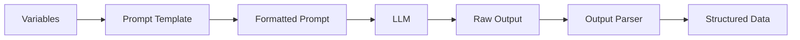
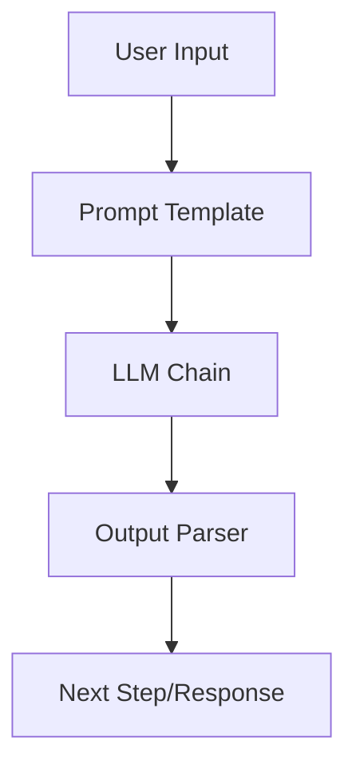

# Kodivian Prompts & Output Parsers Reference Guide

A comprehensive guide to prompts and output parsers in the Kodivian platform. These components control how you communicate with LLMs and parse their responses.

---

## What are Prompts?

**Prompts** are templates that define how to format input for LLMs. They allow you to create reusable, dynamic instructions.

### Why Use Prompt Templates?

```javascript
// Without templates (repetitive)
prompt = "You are a helpful assistant. Answer: " + userInput
prompt = "You are a helpful assistant. Answer: " + anotherInput

// With templates (reusable)
template = "You are a helpful assistant. Answer: {input}"
prompt = template.format(input=userInput)
```

---

## What are Output Parsers?

**Output Parsers** convert LLM text output into structured data (JSON, lists, objects).

### Why Use Output Parsers?

```
LLM Output: "The answer is 42, and the explanation is..."
         ↓
Parser: Extract structured data
         ↓
Result: { answer: 42, explanation: "..." }
```

---

# Part 1: Prompts

## Available Prompts (4)

### 1. Prompt Template
Basic template with variable substitution.

| Setting | Description |
|---------|-------------|
| Template | Text with `{variables}` |
| Input Variables | Variable names (auto-detected) |

**Example**:
```
Template: "Translate the following to {language}: {text}"

Variables: language, text

Usage:
- language: "French"
- text: "Hello world"

Result: "Translate the following to French: Hello world"
```

**Best For**: Simple, single-turn prompts

---

### 2. Chat Prompt Template
Structured messages for chat models.

| Setting | Description |
|---------|-------------|
| System Message | AI personality/instructions |
| Human Message | User input template |
| AI Message | Optional AI response template |
| Messages | Array of message templates |

**Example**:
```
System: "You are a helpful coding assistant."
Human: "Write a function that {task}"
AI: (model generates response)
```

**Message Types**:
| Type | Purpose |
|------|---------|
| System | Set behavior/personality |
| Human | User inputs |
| AI | Pre-fill responses |
| Placeholder | Dynamic message injection |

**Best For**: Chat-based interactions, complex conversations

---

### 3. Few-Shot Prompt Template
Include examples in the prompt.

| Setting | Description |
|---------|-------------|
| Examples | Array of input-output pairs |
| Prefix | Text before examples |
| Suffix | Text after examples (with {input}) |
| Example Separator | Separator between examples |

**Example**:
```
Prefix: "Classify the sentiment:"

Examples:
- Input: "I love this!" → Output: "Positive"
- Input: "This is terrible" → Output: "Negative"

Suffix: "Input: {input} → Output:"

User Input: "Great product!"
Result: "Positive"
```

**Best For**: Classification, formatting, consistent outputs

---

### 4. Prompt (Langfuse)
Managed prompts from Langfuse platform.

| Setting | Description |
|---------|-------------|
| Credential | `langfuseApi` |
| Prompt Name | Langfuse prompt name |
| Version | Prompt version (optional) |

**Features**:
- Version control
- A/B testing
- Analytics
- Remote management

**Best For**: Production prompt management, team collaboration

---

# Part 2: Output Parsers

## Available Output Parsers (4)

### 1. Structured Output Parser
Parse JSON based on schema definition.

| Setting | Description |
|---------|-------------|
| Schema | Field definitions |

**Schema Format**:
```
field_name: description
another_field: description
```

**Example**:
```
Schema:
name: The person's full name
age: The person's age as a number
city: The city where they live

LLM Output:
{
  "name": "John Smith",
  "age": 30,
  "city": "New York"
}
```

**Best For**: Simple structured outputs

---

### 2. Structured Output Parser (Advanced)
Complex JSON schemas with nested fields.

| Setting | Description |
|---------|-------------|
| JSON Schema | Complete JSON schema |
| Example Output | Optional example |

**Example Schema**:
```json
{
  "type": "object",
  "properties": {
    "summary": {
      "type": "string",
      "description": "Brief summary"
    },
    "items": {
      "type": "array",
      "items": {
        "type": "object",
        "properties": {
          "name": { "type": "string" },
          "price": { "type": "number" }
        }
      }
    }
  },
  "required": ["summary", "items"]
}
```

**Best For**: Complex nested structures, strict validation

---

### 3. CSV List Output Parser
Parse comma-separated values into a list.

| Setting | Description |
|---------|-------------|
| (none) | Automatic CSV parsing |

**Example**:
```
LLM Output: "apple, banana, cherry, date"

Parser Result: ["apple", "banana", "cherry", "date"]
```

**Best For**: Simple lists, comma-separated items

---

### 4. Custom List Output Parser
Parse lists with custom separators.

| Setting | Description |
|---------|-------------|
| Separator | Custom separator (e.g., `\n`, `;`) |
| Length | Expected list length (optional) |

**Example**:
```
Separator: "\n"

LLM Output:
"1. First item
2. Second item
3. Third item"

Parser Result: ["1. First item", "2. Second item", "3. Third item"]
```

**Best For**: Custom list formats, numbered lists

---

# Feature Comparison

## Prompts

| Feature | Basic | Chat | Few-Shot | Langfuse |
|---------|-------|------|----------|----------|
| **Variables** | ✅ | ✅ | ✅ | ✅ |
| **Multiple messages** | ❌ | ✅ | ❌ | ❌ |
| **Examples** | ❌ | ❌ | ✅ | ❌ |
| **Version control** | ❌ | ❌ | ❌ | ✅ |
| **Remote management** | ❌ | ❌ | ❌ | ✅ |

## Output Parsers

| Feature | Structured | Advanced | CSV | Custom List |
|---------|------------|----------|-----|-------------|
| **JSON output** | ✅ | ✅ | ❌ | ❌ |
| **Nested objects** | ❌ | ✅ | ❌ | ❌ |
| **Arrays** | ❌ | ✅ | ✅ | ✅ |
| **Custom format** | ❌ | ✅ | ❌ | ✅ |
| **Validation** | Basic | Strict | ❌ | ❌ |

---

# Best Practices

## 1. Prompt Engineering Tips

### Be Specific
```
❌ Bad: "Summarize this"
✅ Good: "Summarize the following text in 3 bullet points, 
         focusing on key findings: {text}"
```

### Use System Messages Effectively
```
System: "You are a senior Python developer with 10 years of 
experience. You write clean, well-documented code following 
PEP 8 standards. Always explain your code with comments."
```

### Include Output Format
```
"Respond in the following JSON format:
{
  'answer': your answer here,
  'confidence': high/medium/low,
  'sources': [list of sources]
}"
```

## 2. Few-Shot Prompting

### When to Use
- Classification tasks
- Formatting requirements
- Consistent output structure
- Complex reasoning patterns

### How Many Examples
| Task Complexity | Examples |
|-----------------|----------|
| Simple classification | 2-3 |
| Complex format | 3-5 |
| Nuanced reasoning | 5-10 |

## 3. Output Parser Selection

| Need | Use |
|------|-----|
| Simple key-value | Structured Parser |
| Nested JSON | Advanced Structured |
| Comma list | CSV Parser |
| Custom format | Custom List |
| Maximum flexibility | Advanced Structured |

## 4. Error Handling

```javascript
// Always handle parsing errors
try {
  result = parser.parse(llmOutput)
} catch (error) {
  // Retry with clarification prompt
  // Or return raw text
}
```

---

# Integration Flow

## Prompt → LLM → Parser



## Use with Chains



---

# Common Patterns

## 1. Classification with Few-Shot

```
Examples:
- "Great product!" → Positive
- "Terrible experience" → Negative
- "It's okay" → Neutral

Input: "{text}" → 
```

## 2. JSON Extraction

```
Extract the following information as JSON:
- name
- email
- phone
- address

Text: {input}

Respond only with valid JSON, no explanation.
```

## 3. Structured Analysis

```
Analyze the following and respond in this format:

SUMMARY:
[Brief 2-3 sentence summary]

KEY POINTS:
- Point 1
- Point 2
- Point 3

CONCLUSION:
[Your conclusion]

Text: {input}
```
