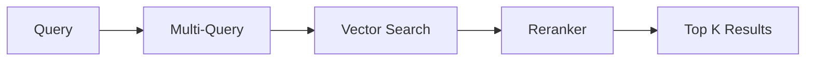
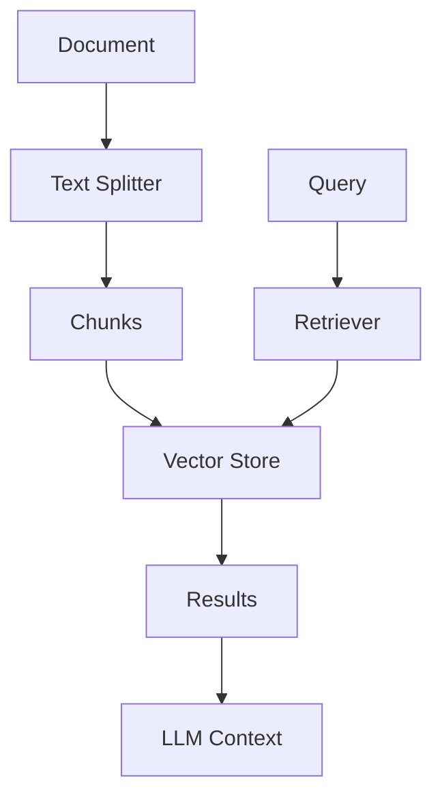

# Autonomous Retrievers & Text Splitters Reference Guide

A comprehensive guide to retrievers and text splitters in the Autonomous platform. These components are essential for high-quality RAG (Retrieval-Augmented Generation) applications.

---

## What are Retrievers?

**Retrievers** fetch relevant documents from vector stores based on a query. They're the "search" component of RAG.

### How Retrievers Work

```
User Query: "How do I reset my password?"
         ↓
Retriever: Search vector store
         ↓
Returns: Top K most relevant documents
         ↓
LLM: Use documents as context to answer
```

---

## What are Text Splitters?

**Text Splitters** divide large documents into smaller chunks for embedding and retrieval.

### Why Split Text?

| Problem | Solution |
|---------|----------|
| Documents too large for context | Split into chunks |
| Embedding models have limits | Fit within token limits |
| Relevance diluted in long docs | Smaller chunks = better matching |

---

# Part 1: Retrievers

## Quick Decision Matrix

| Retriever | Purpose | When to Use |
|-----------|---------|-------------|
| **Vector Store Retriever** | Basic similarity search | Default choice |
| **Multi-Query Retriever** | Generate multiple queries | Improve recall |
| **HyDE Retriever** | Hypothetical document | Complex queries |
| **Cohere Rerank** | Re-order by relevance | Production quality |
| **RRF Retriever** | Hybrid search fusion | Multiple sources |
| **Similarity Threshold** | Filter by score | Quality control |

---

## 1. Vector Store Retriever
Basic retriever that searches a vector store.

| Setting | Description |
|---------|-------------|
| Vector Store | Connected vector store |
| Top K | Number of results (default: 4) |

**Best For**: Simple RAG applications, getting started

---

## 2. Multi-Query Retriever
Generates multiple query variations to improve recall.

| Setting | Description |
|---------|-------------|
| Vector Store | Connected vector store |
| LLM | Model for query generation |
| Number of Queries | Variations to generate |
| Top K | Results per query |

**How It Works**:
```
Original: "What are the benefits of exercise?"
         ↓
Generated Queries:
1. "Why is exercise good for health?"
2. "Exercise advantages and positive effects"
3. "Health benefits from physical activity"
         ↓
Search all queries → Combine unique results
```

**Best For**: Improving recall, handling ambiguous queries

---

## 3. HyDE Retriever (Hypothetical Document Embeddings)
Generates a hypothetical answer, then searches for similar documents.

| Setting | Description |
|---------|-------------|
| Vector Store | Connected vector store |
| LLM | Model for hypothesis |
| Prompt | Custom hypothesis prompt |
| Top K | Results to return |

**How It Works**:
```
Query: "How do I fix error 404?"
         ↓
LLM generates hypothetical answer:
"To fix error 404, check the URL spelling,
verify the page exists, and clear cache..."
         ↓
Search for documents similar to this answer
```

**Best For**: Technical queries, when user phrasing differs from documentation

---

## 4. Cohere Rerank Retriever
Re-ranks results using Cohere's semantic understanding.

| Setting | Description |
|---------|-------------|
| Credential | `cohereApi` |
| Base Retriever | Initial retriever |
| Model | rerank-english, rerank-multilingual |
| Top N | Final results after rerank |

**How It Works**:
```
Initial retrieval: 20 documents
         ↓
Cohere Rerank: Score relevance to query
         ↓
Return: Top 5 most relevant
```

**Best For**: Production RAG, significantly improves quality

---

## 5. Jina Rerank Retriever
Re-ranks using Jina AI's reranker.

| Setting | Description |
|---------|-------------|
| Credential | `jinaAIApi` |
| Base Retriever | Initial retriever |
| Top N | Final results |

---

## 6. Voyage AI Retriever
Rerank with Voyage AI's specialized models.

| Setting | Description |
|---------|-------------|
| Credential | `voyageAIApi` |
| Base Retriever | Initial retriever |
| Model | rerank-1, rerank-lite-1 |

---

## 7. RRF Retriever (Reciprocal Rank Fusion)
Combines results from multiple retrievers.

| Setting | Description |
|---------|-------------|
| Retrievers | Array of retrievers |
| K Parameter | Fusion constant (default: 60) |
| Top K | Final results |

**How It Works**:
```
Retriever 1: [Doc A, Doc B, Doc C]
Retriever 2: [Doc B, Doc D, Doc A]
         ↓
RRF Score: Combines rankings
         ↓
Result: [Doc A, Doc B, Doc D, Doc C]
```

**Best For**: Hybrid search (vector + keyword), multiple vector stores

---

## 8. Similarity Threshold Retriever
Only returns documents above a similarity score.

| Setting | Description |
|---------|-------------|
| Vector Store | Connected vector store |
| Threshold | Minimum similarity (0.0-1.0) |
| Top K | Maximum results |

**Best For**: Quality control, avoiding irrelevant results

---

## 9. Embeddings Filter Retriever
Filters results by embedding similarity.

| Setting | Description |
|---------|-------------|
| Base Retriever | Initial retriever |
| Embeddings | Embedding model |
| K | Documents to keep |
| Threshold | Optional similarity threshold |

---

## 10. LLM Filter Retriever
Uses LLM to judge document relevance.

| Setting | Description |
|---------|-------------|
| Base Retriever | Initial retriever |
| LLM | Model for filtering |

**How It Works**:
```
Retrieved: 10 documents
         ↓
LLM judges each: "Is this relevant to the query?"
         ↓
Keep only relevant documents
```

**Best For**: High-precision requirements

---

## 11. Extract Metadata Retriever
Extracts and attaches metadata during retrieval.

| Setting | Description |
|---------|-------------|
| Base Retriever | Initial retriever |
| Metadata Keys | Keys to extract |

---

## 12. Prompt Retriever
Uses custom prompts for retrieval logic.

| Setting | Description |
|---------|-------------|
| Base Retriever | Initial retriever |
| Prompt | Custom retrieval prompt |

---

## 13. AWS Bedrock Knowledge Base Retriever
Retrieves from AWS Bedrock Knowledge Base.

| Setting | Description |
|---------|-------------|
| Credential | `awsApi` |
| Knowledge Base ID | Bedrock KB ID |
| Region | AWS region |
| Top K | Results to return |

---

## 14. Custom Retriever
Build your own retriever with JavaScript.

| Setting | Description |
|---------|-------------|
| JavaScript Code | Retriever implementation |

---

# Part 2: Text Splitters

## Quick Decision Matrix

| Splitter | Best For | Chunk Boundary |
|----------|----------|----------------|
| **Recursive Character** | General text | Paragraphs → Sentences |
| **Character** | Simple splitting | Fixed character count |
| **Token** | LLM token limits | Token count |
| **Code** | Source code | Language-aware |
| **Markdown** | Markdown docs | Headers, sections |
| **HTML to Markdown** | HTML content | Convert + split |

---

## 1. Recursive Character Text Splitter
**Most common choice.** Recursively splits on natural boundaries.

| Setting | Description | Default |
|---------|-------------|---------|
| Chunk Size | Characters per chunk | 1000 |
| Chunk Overlap | Overlapping characters | 200 |
| Separators | Split boundaries | `["\n\n", "\n", " ", ""]` |

**How It Works**:
```
Priority: Split on paragraph breaks first
         ↓
If still too large: Split on line breaks
         ↓
If still too large: Split on spaces
         ↓
If still too large: Split on characters
```

**Best For**: General documents, most use cases

---

## 2. Character Text Splitter
Simple splitting by character count.

| Setting | Description | Default |
|---------|-------------|---------|
| Chunk Size | Characters per chunk | 1000 |
| Chunk Overlap | Overlapping characters | 200 |
| Separator | Split character | `\n\n` |

**Best For**: Simple, predictable splitting

---

## 3. Token Text Splitter
Splits by token count (matches LLM limits).

| Setting | Description | Default |
|---------|-------------|---------|
| Chunk Size | Tokens per chunk | 500 |
| Chunk Overlap | Overlapping tokens | 50 |
| Encoding | Token encoding | cl100k_base |

**Best For**: Precise token control, avoiding truncation

---

## 4. Code Text Splitter
Language-aware splitting for source code.

| Setting | Description |
|---------|-------------|
| Language | python, javascript, java, etc. |
| Chunk Size | Characters per chunk |
| Chunk Overlap | Overlapping characters |

**Supported Languages**:
- Python, JavaScript, TypeScript
- Java, C, C++, C#
- Go, Ruby, Rust, PHP
- HTML, CSS, Markdown
- And many more...

**Best For**: Code documentation, repositories

---

## 5. Markdown Text Splitter
Splits markdown by headers and structure.

| Setting | Description | Default |
|---------|-------------|---------|
| Chunk Size | Characters per chunk | 1000 |
| Chunk Overlap | Overlapping characters | 200 |

**How It Works**:
```
Splits on: # Header 1
          ## Header 2
          ### Header 3
          etc.
```

**Best For**: Documentation, README files, wiki pages

---

## 6. HTML to Markdown Text Splitter
Converts HTML to markdown, then splits.

| Setting | Description | Default |
|---------|-------------|---------|
| Chunk Size | Characters per chunk | 1000 |
| Chunk Overlap | Overlapping characters | 200 |

**Best For**: Web content, HTML documents

---

# Feature Comparison

## Retrievers

| Feature | Vector Store | Multi-Query | HyDE | Rerank |
|---------|--------------|-------------|------|--------|
| **Simple** | ✅ | ❌ | ❌ | ❌ |
| **No extra LLM** | ✅ | ❌ | ❌ | ✅ |
| **Improved recall** | ❌ | ✅ | ✅ | ❌ |
| **Improved precision** | ❌ | ❌ | ❌ | ✅ |
| **Latency** | Low | Medium | Medium | Medium |

## Text Splitters

| Feature | Recursive | Token | Code | Markdown |
|---------|-----------|-------|------|----------|
| **General text** | ✅ | ✅ | ❌ | ❌ |
| **Source code** | ❌ | ❌ | ✅ | ❌ |
| **Structured docs** | ❌ | ❌ | ❌ | ✅ |
| **Token precise** | ❌ | ✅ | ❌ | ❌ |

---

# Best Practices

## 1. Chunk Size Guidelines

| Content Type | Chunk Size | Overlap |
|--------------|------------|---------|
| Dense technical | 500-800 | 100-150 |
| Conversational | 1000-1500 | 200 |
| Code | 1000-2000 | 200 |
| Legal/formal | 800-1200 | 150 |

## 2. Retriever Pipeline



## 3. Improving RAG Quality

| Issue | Solution |
|-------|----------|
| Missing relevant docs | Multi-Query Retriever |
| Irrelevant results | Add Reranker |
| Poor chunk boundaries | Use appropriate splitter |
| Low similarity scores | Adjust embeddings/chunking |

## 4. Integration Flow


