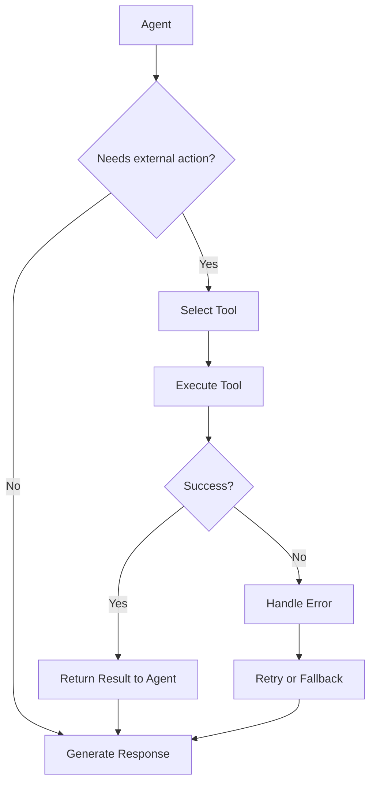

# Kodivian Tools Reference Guide

A comprehensive guide to all available tools in the Kodivian platform. Tools enable agents to take actions and interact with external systems.

---

## What are Tools?

**Tools** are functions that agents can call to perform specific actions like searching the web, sending emails, or making API requests.

### How Tools Work

```
User: "Search for the latest news about AI"
         ↓
Agent decides to use: Web Search Tool
         ↓
Tool executes: Calls search API
         ↓
Agent receives: Search results
         ↓
Agent responds: "Here are the latest AI news..."
```

### Key Benefits
- **Extend capabilities**: Agents can do more than just generate text
- **Real-world actions**: Send emails, create documents, query databases
- **Integration**: Connect to external APIs and services

---

## Tools Quick Decision Matrix

| Category | Tools | Use Case |
|----------|-------|----------|
| **Web Search** | Serper, Google, Brave, Tavily, SerpAPI | Find information online |
| **Google Workspace** | Gmail, Calendar, Docs, Sheets, Drive | Productivity automation |
| **Microsoft Office** | Outlook, Teams | Enterprise productivity |
| **HTTP Requests** | GET, POST, PUT, DELETE | API integrations |
| **Utilities** | Calculator, DateTime, JSONPath | Data processing |
| **Custom** | CustomTool, OpenAPI, MCP | Build your own |

---

# Web Search Tools

## 1. Serper (Google Search API)
Fast Google Search results via Serper.dev API.

| Setting | Description |
|---------|-------------|
| Credential | `serperApi` (API Key) |

**Best For**: Fast, affordable Google search results

---

## 2. Google Search API
Official Google Custom Search API.

| Setting | Description |
|---------|-------------|
| Credential | `googleSearchApi` (API Key + CSE ID) |

**Best For**: Official Google integration

---

## 3. Brave Search API
Privacy-focused search via Brave.

| Setting | Description |
|---------|-------------|
| Credential | `braveSearchApi` (API Key) |

**Best For**: Privacy-focused search, no tracking

---

## 4. Tavily API
AI-optimized search for RAG and agents.

| Setting | Description |
|---------|-------------|
| Credential | `tavilyApi` (API Key) |
| Search Depth | basic / advanced |
| Include Answer | Return AI-generated answer |

**Best For**: Agent-optimized search, includes summaries

---

## 5. SerpAPI
Google, Bing, Yahoo, and more search engines.

| Setting | Description |
|---------|-------------|
| Credential | `serpApi` (API Key) |

**Best For**: Multi-engine search

---

## 6. Exa Search
AI-powered semantic search.

| Setting | Description |
|---------|-------------|
| Credential | `exaApi` (API Key) |
| Search Type | neural / keyword |

**Best For**: Semantic understanding of queries

---

## 7. SearchApi
Multi-engine search aggregator.

| Setting | Description |
|---------|-------------|
| Credential | `searchApi` (API Key) |
| Engine | google, bing, baidu, etc. |

---

## 8. Searxng
Self-hosted meta search engine.

| Setting | Description |
|---------|-------------|
| Base URL | Searxng instance URL |

**Best For**: Privacy, self-hosted

---

# Google Workspace Tools

## 9. Gmail Tool
Send, read, search, and manage emails.

| Action | Description |
|--------|-------------|
| Send Email | Compose and send emails |
| Read Email | Read email content |
| Search Emails | Find emails by query |
| Get Labels | List email labels |
| Create Draft | Save email as draft |
| List Messages | Get email list |

| Setting | Description |
|---------|-------------|
| Credential | `gmailOAuth2` |
| Max Results | Limit returned emails |

**Credential Setup**: OAuth2 with Gmail API scopes

---

## 10. Google Calendar Tool
Create, read, update, delete calendar events.

| Action | Description |
|--------|-------------|
| Create Event | Schedule new event |
| Get Events | List upcoming events |
| Update Event | Modify event details |
| Delete Event | Remove event |

| Setting | Description |
|---------|-------------|
| Credential | `googleCalendarOAuth2` |
| Calendar ID | Target calendar |

---

## 11. Google Docs Tool
Create and read Google Documents.

| Action | Description |
|--------|-------------|
| Create Document | New Google Doc |
| Get Document | Read document content |
| Append Text | Add text to doc |

| Setting | Description |
|---------|-------------|
| Credential | `googleDocsOAuth2` |

---

## 12. Google Sheets Tool
Read, write, and manage spreadsheets.

| Action | Description |
|--------|-------------|
| Read Sheet | Get spreadsheet data |
| Write Sheet | Update cells |
| Append Row | Add new row |
| Get Sheet Names | List sheets |

| Setting | Description |
|---------|-------------|
| Credential | `googleSheetsOAuth2` |
| Spreadsheet ID | Target spreadsheet |
| Sheet Name | Target sheet/tab |

---

## 13. Google Drive Tool
Upload, download, search files.

| Action | Description |
|--------|-------------|
| Upload File | Upload to Drive |
| Download File | Get file content |
| Search Files | Find files |
| List Files | Get file list |

| Setting | Description |
|---------|-------------|
| Credential | `googleDriveOAuth2` |

---

# Microsoft Office Tools

## 14. Microsoft Outlook Tool
Email and calendar via Microsoft Graph API.

| Action | Description |
|--------|-------------|
| Send Email | Compose and send |
| Read Emails | Get inbox messages |
| Search Emails | Find by query |
| Create Event | Schedule calendar event |

| Setting | Description |
|---------|-------------|
| Credential | `microsoftOutlookOAuth2` |

---

## 15. Microsoft Teams Tool
Send messages and manage Teams.

| Action | Description |
|--------|-------------|
| Send Message | Post to channel |
| List Channels | Get team channels |
| List Teams | Get user's teams |

| Setting | Description |
|---------|-------------|
| Credential | `microsoftTeamsOAuth2` |

---

# HTTP Request Tools

## 16. Requests GET
Make HTTP GET requests.

| Setting | Description |
|---------|-------------|
| URL | Target endpoint |
| Headers | Custom headers (JSON) |

---

## 17. Requests POST
Make HTTP POST requests.

| Setting | Description |
|---------|-------------|
| URL | Target endpoint |
| Body | Request body (JSON) |
| Headers | Custom headers (JSON) |

---

## 18. Requests PUT
Make HTTP PUT requests.

| Setting | Description |
|---------|-------------|
| URL | Target endpoint |
| Body | Request body (JSON) |
| Headers | Custom headers (JSON) |

---

## 19. Requests DELETE
Make HTTP DELETE requests.

| Setting | Description |
|---------|-------------|
| URL | Target endpoint |
| Headers | Custom headers (JSON) |

---

# Project Management Tools

## 20. Jira Tool
Manage Jira issues and projects.

| Action | Description |
|--------|-------------|
| Create Issue | New Jira ticket |
| Get Issue | Read issue details |
| Update Issue | Modify issue |
| Search Issues | JQL query |
| Add Comment | Comment on issue |

| Setting | Description |
|---------|-------------|
| Credential | `jiraApi` |
| Base URL | Jira instance URL |

---

# Utility Tools

## 21. Calculator
Perform mathematical calculations.

| Setting | Description |
|---------|-------------|
| (none) | Built-in |

**Example**: "What is 25 * 4 + 10?" → 110

---

## 22. Current DateTime
Get current date and time.

| Setting | Description |
|---------|-------------|
| Timezone | Optional timezone |

**Example**: "What time is it?" → "2024-12-19 19:58:23"

---

## 23. JSONPath Extractor
Extract data from JSON using JSONPath.

| Setting | Description |
|---------|-------------|
| JSONPath | Query expression |
| JSON | Source JSON string |

**Example**: `$.store.book[0].title` → First book title

---

## 24. Wolfram Alpha
Computational knowledge engine.

| Setting | Description |
|---------|-------------|
| Credential | `wolframAlphaApi` |

**Best For**: Math, science, data computations

---

## 25. Arxiv
Search academic papers.

| Setting | Description |
|---------|-------------|
| Max Results | Limit results |

**Best For**: Research, academic content

---

## 26. Web Scraper Tool
Extract content from web pages.

| Setting | Description |
|---------|-------------|
| URL | Target webpage |
| Selector | CSS selector (optional) |

---

# Custom & Integration Tools

## 27. Custom Tool
Create your own tool with JavaScript code.

| Setting | Description |
|---------|-------------|
| Tool Name | Unique identifier |
| Tool Description | What the tool does |
| JavaScript Code | Tool implementation |
| Input Schema | JSON schema for inputs |

**Example Use Cases**:
- Custom API integrations
- Business logic
- Data transformations

---

## 28. OpenAPI Toolkit
Generate tools from OpenAPI/Swagger spec.

| Setting | Description |
|---------|-------------|
| OpenAPI Spec | URL or YAML/JSON content |

**Best For**: Auto-generate tools from existing APIs

---

## 29. MCP (Model Context Protocol)
Connect to MCP servers for extended capabilities.

| Setting | Description |
|---------|-------------|
| MCP Server | Server configuration |
| Transport | stdio / sse |

**Best For**: Extending agent capabilities via MCP protocol

---

## 30. Composio
Pre-built integrations for 150+ apps.

| Setting | Description |
|---------|-------------|
| Credential | `composioApi` |
| Actions | Selected actions |

**Best For**: Quick integrations without OAuth setup

---

## 31. Chatflow Tool
Use another chatflow as a tool.

| Setting | Description |
|---------|-------------|
| Chatflow | Select existing chatflow |

**Best For**: Modular agent design

---

## 32. Agent as Tool
Use another agent as a tool.

| Setting | Description |
|---------|-------------|
| Agent | Select existing agent |

**Best For**: Hierarchical agent systems

---

## 33. Code Interpreter (E2B)
Execute Python code in sandboxed environment.

| Setting | Description |
|---------|-------------|
| Credential | `e2bApi` |

**Best For**: Safe code execution, data analysis

---

## 34. AWS DynamoDB KV Storage
Store and retrieve key-value pairs.

| Setting | Description |
|---------|-------------|
| Credential | `awsApi` |
| Table Name | DynamoDB table |

---

## 35. AWS SNS
Send notifications via AWS SNS.

| Setting | Description |
|---------|-------------|
| Credential | `awsApi` |
| Topic ARN | SNS topic |

---

# Tool Feature Comparison

| Tool | Auth Type | Rate Limits | Free Tier |
|------|-----------|-------------|-----------|
| **Serper** | API Key | 2500/month | ✅ |
| **Google Search** | API Key | 100/day | ✅ |
| **Brave Search** | API Key | 2000/month | ✅ |
| **Tavily** | API Key | 1000/month | ✅ |
| **Gmail** | OAuth2 | Google limits | ✅ |
| **Custom Tool** | None | None | ✅ |
| **Calculator** | None | None | ✅ |

---

# Best Practices

## 1. Choosing Search Tools

| Need | Recommendation |
|------|----------------|
| General web search | Serper or Tavily |
| Privacy-focused | Brave or Searxng |
| Academic research | Arxiv |
| AI-optimized | Tavily or Exa |

## 2. OAuth Tools Setup

1. Create OAuth credentials in provider console
2. Add redirect URI: `{YOUR_APP_URL}/api/v1/oauth/callback`
3. Add credential in Kodivian
4. Connect and authorize

## 3. Custom Tool Best Practices

```javascript
// Good: Clear description
const tool = {
  name: "get_weather",
  description: "Get current weather for a city. Input: city name string.",
  // ...
}

// Bad: Vague description
const tool = {
  name: "tool1",
  description: "Does stuff",
  // ...
}
```

## 4. Error Handling

- Tools should return clear error messages
- Handle rate limits gracefully
- Provide fallback options when possible

---

# Integration Flow


