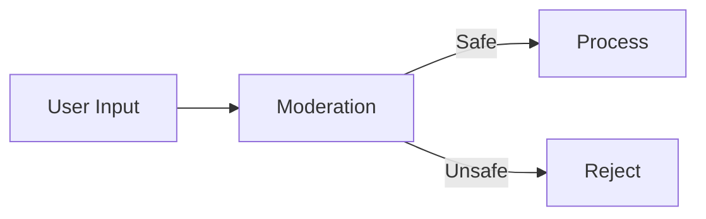

# Kodivian Utilities & Advanced Components Reference Guide

A comprehensive guide to analytics, moderation, graphs, record managers, response synthesizers, utilities, and speech-to-text nodes in the Kodivian platform.

---

## Overview

This guide covers specialized nodes that enhance your AI applications:

| Category | Nodes | Purpose |
|----------|-------|---------|
| **Analytics** | 7 | Observability & monitoring |
| **Moderation** | 2 | Content safety |
| **Graphs** | 1 | Graph database connections |
| **Record Manager** | 3 | Upsert deduplication |
| **Response Synthesizer** | 4 | Answer generation strategies |
| **Utilities** | 5 | Helper functions |
| **Speech-to-Text** | 1 | Audio transcription |

---

# Part 1: Analytics & Observability

Track, monitor, and debug your LLM applications.

## Quick Decision Matrix

| Platform | Best For | Self-Hosted | Free Tier |
|----------|----------|-------------|-----------|
| **Langfuse** | Open source, detailed traces | ✅ | ✅ |
| **LangSmith** | LangChain native | ❌ | ✅ |
| **LangWatch** | Real-time monitoring | ❌ | ✅ |
| **Lunary** | Cost tracking | ❌ | ✅ |
| **Arize** | ML observability | ❌ | ✅ |
| **Phoenix** | Open source traces | ✅ | ✅ |
| **Opik** | Experiment tracking | ❌ | ✅ |

---

## 1. Langfuse
Open-source LLM observability platform.

| Setting | Description |
|---------|-------------|
| Credential | `langfuseApi` |
| Release | Optional release tag |
| User ID | Optional user identifier |
| Session ID | Session tracking |

**Features**:
- Trace visualization
- Cost tracking
- Prompt management
- User feedback
- Self-hosted option

**Best For**: Open-source, detailed debugging

---

## 2. LangSmith
LangChain's official observability platform.

| Setting | Description |
|---------|-------------|
| Credential | `langsmithApi` |
| Project Name | LangSmith project |

**Features**:
- Native LangChain integration
- Dataset management
- Evaluation tools
- Prompt hub

**Best For**: LangChain users, prompt testing

---

## 3. LangWatch
Real-time LLM monitoring and guardrails.

| Setting | Description |
|---------|-------------|
| Credential | `langwatchApi` |

**Features**:
- Real-time dashboards
- Quality metrics
- Guardrails
- Alerts

---

## 4. Lunary
LLM analytics with cost focus.

| Setting | Description |
|---------|-------------|
| Credential | `lunaryApi` |
| User ID | Optional user tracking |

**Features**:
- Cost tracking
- Usage analytics
- User segmentation
- Event logging

---

## 5. Arize
ML observability for production models.

| Setting | Description |
|---------|-------------|
| Credential | `arizeApi` |

**Features**:
- Model performance monitoring
- Drift detection
- Embedding visualization

---

## 6. Phoenix
Open-source observability by Arize.

| Setting | Description |
|---------|-------------|
| Endpoint | Phoenix server URL |

**Features**:
- Trace visualization
- Embedding analysis
- Self-hosted

---

## 7. Opik (Comet)
Experiment tracking for LLMs.

| Setting | Description |
|---------|-------------|
| Credential | `opikApi` |

**Features**:
- Experiment tracking
- Comparison tools
- Collaboration

---

# Part 2: Content Moderation

Ensure safe, appropriate AI outputs.

## 1. OpenAI Moderation
Uses OpenAI's moderation API.

| Setting | Description |
|---------|-------------|
| Credential | `openAIApi` |

**Categories Detected**:
- hate
- hate/threatening
- harassment
- self-harm
- sexual
- violence
- violence/graphic

**Usage**:
Connect to the "Input Moderation" slot on chains to filter unsafe inputs before processing.

---

## 2. Simple Prompt Moderation
Custom keyword-based moderation.

| Setting | Description |
|---------|-------------|
| Deny List | Words/phrases to block |
| Error Message | Custom rejection message |

**Example**:
```
Deny List: "password, credit card, SSN, hack"
Error Message: "I cannot help with that request."
```

**Best For**: Simple blocklists, custom rules

---

# Part 3: Graph Databases

## Neo4j Graph
Connect to Neo4j graph database.

| Setting | Description |
|---------|-------------|
| Credential | `neo4jApi` |
| URL | Neo4j bolt URL |
| Database | Database name |

**Used With**: GraphCypherQAChain for natural language graph queries.

**Example Use Case**:
```
User: "What movies did Tom Hanks act in?"
         ↓
Graph Query: MATCH (p:Person {name:'Tom Hanks'})-[:ACTED_IN]->(m:Movie) RETURN m.title
         ↓
Response: "Forrest Gump, Cast Away, Saving Private Ryan..."
```

---

# Part 4: Record Managers

Prevent duplicate documents during upsert operations.

## What are Record Managers?

When upserting documents to vector stores, Record Managers track which documents have been processed to avoid duplicates.

### How It Works

```
Document: "Chapter 1 content..."
         ↓
Record Manager: "Have I seen this before?"
         ↓
If new → Upsert to vector store
If exists → Skip or update
```

---

## 1. PostgreSQL Record Manager
Track records in PostgreSQL.

| Setting | Description |
|---------|-------------|
| Credential | `postgresApi` |
| Host | Database host |
| Database | Database name |
| Table Name | Record table |
| Namespace | Isolation namespace |
| Cleanup | none / incremental / full |

---

## 2. MySQL Record Manager
Track records in MySQL.

| Setting | Description |
|---------|-------------|
| Credential | `mySQLApi` |
| Host | Database host |
| Database | Database name |
| Table Name | Record table |
| Namespace | Isolation namespace |

---

## 3. SQLite Record Manager
Lightweight local record tracking.

| Setting | Description |
|---------|-------------|
| Database File Path | SQLite file location |
| Table Name | Record table |
| Namespace | Isolation namespace |

**Best For**: Development, simple deployments

---

## Cleanup Modes

| Mode | Behavior |
|------|----------|
| **None** | Never delete, only add |
| **Incremental** | Delete records not in current batch |
| **Full** | Delete all before inserting |

---

# Part 5: Response Synthesizers

Strategies for generating answers from retrieved documents.

## 1. Simple Response Builder
Concatenates documents and generates one response.

| Setting | Description |
|---------|-------------|
| (none) | Default behavior |

**Process**:
```
Documents: [Doc1, Doc2, Doc3]
         ↓
Combine into single context
         ↓
LLM: Generate answer from context
```

**Best For**: Simple RAG, short documents

---

## 2. Refine
Iteratively refines answer with each document.

| Setting | Description |
|---------|-------------|
| Refine Prompt | How to improve with each doc |

**Process**:
```
Doc1 → Initial answer
Doc2 → Refine answer
Doc3 → Refine answer further
         ↓
Final refined response
```

**Best For**: High-quality answers, complex topics

---

## 3. Compact Refine
Like Refine but compacts documents first.

| Setting | Description |
|---------|-------------|
| (none) | Default behavior |

**Process**:
```
Documents → Compact into chunks
         ↓
Refine through fewer iterations
```

**Best For**: Balance of quality and speed

---

## 4. Tree Summarize
Hierarchical summarization.

| Setting | Description |
|---------|-------------|
| (none) | Default behavior |

**Process**:
```
Documents → Summarize pairs
         ↓
Summaries → Summarize pairs
         ↓
Final summary
```

**Best For**: Large document sets, comprehensive summaries

---

## Response Synthesizer Comparison

| Strategy | Quality | Speed | Token Usage |
|----------|---------|-------|-------------|
| Simple | Good | Fast | Low |
| Refine | Best | Slow | High |
| Compact Refine | Very Good | Medium | Medium |
| Tree Summarize | Good | Medium | Medium |

---

# Part 6: Utilities

Helper nodes for flow control and data management.

## 1. Custom Function
Execute JavaScript code within the flow.

| Setting | Description |
|---------|-------------|
| Input Variables | Variables to pass in |
| JavaScript Function | Your code |
| Output Variables | Variables to return |

**Example**:
```javascript
const input = $input;
const result = {
  processed: true,
  timestamp: new Date().toISOString(),
  wordCount: input.text.split(' ').length
};
return result;
```

---

## 2. Set Variable
Store a value for later use.

| Setting | Description |
|---------|-------------|
| Variable Name | Name to store under |
| Variable Value | Value to store |

**Use Case**: Save intermediate results

---

## 3. Get Variable
Retrieve a stored variable.

| Setting | Description |
|---------|-------------|
| Variable Name | Name to retrieve |

---

## 4. If/Else Function
Conditional branching with JavaScript.

| Setting | Description |
|---------|-------------|
| Condition | JavaScript returning true/false |
| If True | Value/action if true |
| If False | Value/action if false |

**Example**:
```javascript
return $input.sentiment === 'positive';
```

---

## 5. Sticky Note
Documentation node (no execution).

| Setting | Description |
|---------|-------------|
| Note | Text content |
| Color | Visual color |

**Use Case**: Document your flows

---

# Part 7: Speech-to-Text

## AssemblyAI
Convert audio to text.

| Setting | Description |
|---------|-------------|
| Credential | `assemblyAIApi` |
| Audio URL | URL of audio file |

**Features**:
- High accuracy transcription
- Speaker diarization
- Content moderation
- Summarization

**Supported Formats**: MP3, WAV, M4A, etc.

**Use Case**:
```
Audio File → AssemblyAI → Transcribed Text → LLM Processing
```

---

# Best Practices

## 1. Analytics Integration

| Environment | Recommendation |
|-------------|----------------|
| Development | Phoenix (local) |
| Staging | Langfuse (free tier) |
| Production | LangSmith or Langfuse |

## 2. Moderation Pipeline



## 3. Record Manager Usage

- Always use in production vector store pipelines
- Match namespace to your use case
- Use incremental cleanup for regular updates

## 4. Response Synthesizer Selection

| Scenario | Use |
|----------|-----|
| FAQ, short docs | Simple |
| Research, analysis | Refine |
| Large doc sets | Tree Summarize |
| Balanced | Compact Refine |
