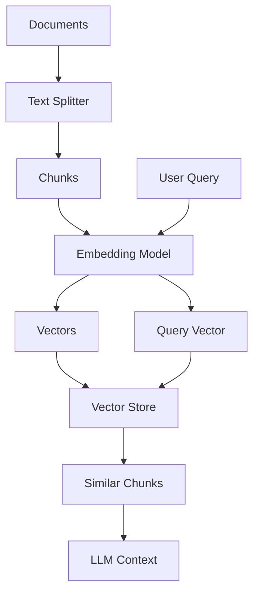

# Kodivian Vector Stores Reference Guide

A comprehensive guide to all vector store options in the Kodivian platform. Vector stores enable semantic search by storing and querying document embeddings.

---

## What are Vector Stores?

**Vector Stores** are specialized databases that store document embeddings (numerical representations) and enable similarity search.

### How Vector Stores Work

```
Document: "Paris is the capital of France"
         ↓
Embedding Model: Convert to vector
         ↓
Vector: [0.023, -0.045, 0.089, ..., 0.012]
         ↓
Store in Vector Database
         ↓
Query: "What is the capital of France?"
         ↓
Find similar vectors → Return "Paris is the capital of France"
```

### Key Benefits
- **Semantic search**: Find related content, not just exact matches
- **RAG applications**: Retrieve relevant context for AI responses
- **Scalable**: Handle millions of documents efficiently

---

## Quick Decision Matrix

| Vector Store | Best For | Self-Hosted | Cloud | Free Tier |
|--------------|----------|-------------|-------|-----------|
| **Pinecone** | Production, managed | ❌ | ✅ | ✅ |
| **Chroma** | Development, simple | ✅ | ❌ | ✅ |
| **Milvus** | Enterprise, performance | ✅ | ✅ (Zilliz) | ✅ |
| **Qdrant** | Performance, filtering | ✅ | ✅ | ✅ |
| **Weaviate** | Hybrid search | ✅ | ✅ | ✅ |
| **PostgreSQL (pgvector)** | Existing Postgres | ✅ | ✅ | ✅ |
| **Supabase** | Postgres + Auth | ❌ | ✅ | ✅ |
| **MongoDB Atlas** | Existing MongoDB | ❌ | ✅ | ✅ |
| **Redis** | Speed, existing Redis | ✅ | ✅ | ✅ |
| **Elasticsearch** | Full-text + vector | ✅ | ✅ | ✅ |
| **InMemory** | Testing only | ✅ | N/A | ✅ |

---

## Available Vector Stores (23)

# Cloud-Managed Vector Stores

## 1. Pinecone
Fully managed vector database, industry leader.

| Setting | Description |
|---------|-------------|
| Credential | `pineconeApi` (API Key) |
| Index Name | Pinecone index |
| Namespace | Optional namespace |
| Top K | Results to return |

**Features**:
- Serverless and pod-based options
- Metadata filtering
- Real-time indexing
- 99.99% uptime SLA

**Best For**: Production RAG applications, enterprise

---

## 2. Qdrant
High-performance vector database with advanced filtering.

| Setting | Description |
|---------|-------------|
| Credential | `qdrantApi` |
| URL | Qdrant server URL |
| Collection Name | Target collection |
| Top K | Results to return |

**Features**:
- Rich filtering on metadata
- Hybrid search (dense + sparse)
- Quantization for efficiency
- Open source

**Best For**: Performance-critical applications, complex filtering

---

## 3. Weaviate
AI-native vector database with hybrid search.

| Setting | Description |
|---------|-------------|
| Credential | `weaviateApi` |
| Scheme | http / https |
| Host | Weaviate host |
| Index Name | Class name |

**Features**:
- Built-in vectorization modules
- Hybrid search (keyword + vector)
- GraphQL API
- Multi-tenancy

**Best For**: Hybrid search, GraphQL users

---

## 4. Milvus / Zilliz Cloud
Enterprise-grade vector database.

| Setting | Description |
|---------|-------------|
| Credential | `milvusApi` |
| Address | Milvus server |
| Collection Name | Target collection |
| Partition | Optional partition |

**Features**:
- Billion-scale vectors
- GPU acceleration
- Multiple index types
- Highly scalable

**Best For**: Enterprise, large-scale deployments

---

## 5. Hybrid Milvus
Milvus with hybrid search (dense + sparse vectors).

| Setting | Description |
|---------|-------------|
| Credential | `milvusApi` |
| Address | Milvus server |
| Collection Name | Target collection |
| Sparse Embeddings | Sparse vector model |

**Best For**: Combining semantic and keyword search

---

## 6. Vectara
Managed RAG platform with built-in embeddings.

| Setting | Description |
|---------|-------------|
| Credential | `vectaraApi` |
| Corpus ID | Vectara corpus |

**Features**:
- Built-in embeddings (no external model needed)
- Grounded generation
- Cross-language support
- No infrastructure management

**Best For**: Quick RAG setup without embeddings management

---

## 7. Astra DB (DataStax)
Cassandra-based vector database.

| Setting | Description |
|---------|-------------|
| Credential | `astraDBApi` |
| Endpoint | Astra DB endpoint |
| Collection | Target collection |

**Best For**: Cassandra users, enterprise

---

## 8. Upstash Vector
Serverless vector database.

| Setting | Description |
|---------|-------------|
| Credential | `upstashVectorApi` |
| URL | REST URL |

**Features**:
- Serverless (pay per query)
- REST API
- No infrastructure

**Best For**: Serverless applications

---

# Database-Native Vector Stores

## 9. PostgreSQL (pgvector)
Vector search in PostgreSQL using pgvector extension.

| Setting | Description |
|---------|-------------|
| Credential | `postgresApi` |
| Host | Database host |
| Database | Database name |
| Table Name | Target table |
| Port | PostgreSQL port |

**Features**:
- Use existing PostgreSQL
- ACID transactions
- SQL queries + vector search
- IVFFlat and HNSW indexes

**Best For**: Existing PostgreSQL users, SQL workflows

---

## 10. Supabase
PostgreSQL + pgvector with authentication.

| Setting | Description |
|---------|-------------|
| Credential | `supabaseApi` |
| URL | Supabase project URL |
| Table Name | Target table |

**Features**:
- Built on PostgreSQL
- Real-time subscriptions
- Row-level security
- Built-in auth

**Best For**: Full-stack applications with auth

---

## 11. MongoDB Atlas
Vector search in MongoDB.

| Setting | Description |
|---------|-------------|
| Credential | `mongoDBUrlApi` |
| Database | MongoDB database |
| Collection | Target collection |
| Index Name | Vector search index |

**Features**:
- Integrated with MongoDB
- Document + vector search
- Flexible schema
- Atlas managed service

**Best For**: Existing MongoDB users

---

## 12. Elasticsearch
Full-text + vector search.

| Setting | Description |
|---------|-------------|
| Credential | `elasticsearchApi` |
| URL | Elasticsearch URL |
| Index Name | Target index |

**Features**:
- Powerful text search + vectors
- Aggregations
- Scalable cluster
- Hybrid queries

**Best For**: Full-text + semantic search

---

## 13. OpenSearch
AWS-managed search with vector support.

| Setting | Description |
|---------|-------------|
| Credential | `openSearchApi` |
| URL | OpenSearch URL |
| Index Name | Target index |

**Best For**: AWS users, Elasticsearch alternative

---

## 14. Redis
Vector search in Redis.

| Setting | Description |
|---------|-------------|
| Credential | `redisApi` |
| URL | Redis URL |
| Index Name | Index name |

**Features**:
- Extremely fast
- In-memory
- Existing Redis infrastructure
- RediSearch module

**Best For**: Speed-critical, existing Redis

---

## 15. SingleStore
Distributed SQL + vector database.

| Setting | Description |
|---------|-------------|
| Credential | `singlestoreApi` |
| Host | SingleStore host |
| Database | Database name |

**Best For**: Analytical workloads + vector search

---

## 16. Couchbase
NoSQL database with vector search.

| Setting | Description |
|---------|-------------|
| Credential | `couchbaseApi` |
| Connection URL | Couchbase URL |
| Bucket | Target bucket |
| Scope | Collection scope |
| Collection | Target collection |

**Best For**: Existing Couchbase users

---

## 17. AWS Kendra
AWS-managed intelligent search.

| Setting | Description |
|---------|-------------|
| Credential | `awsApi` |
| Region | AWS region |
| Index ID | Kendra index |

**Best For**: AWS enterprise search

---

## 18. Meilisearch
Search engine with vector support.

| Setting | Description |
|---------|-------------|
| Host | Meilisearch URL |
| API Key | Master key |
| Index Name | Target index |

**Best For**: Simple search + vectors

---

# Self-Hosted & Development

## 19. Chroma
Simple, in-memory or persistent vector store.

| Setting | Description |
|---------|-------------|
| Collection Name | Target collection |
| URL | Chroma server URL (optional) |

**Modes**:
- **In-memory**: For testing
- **Persistent**: Local file storage
- **Server**: Remote Chroma server

**Features**:
- Easy to use
- Python native
- Open source
- Quick setup

**Best For**: Development, prototyping, simple apps

---

## 20. InMemory Vector Store
Ephemeral storage for testing.

| Setting | Description |
|---------|-------------|
| (none) | No configuration needed |

**Best For**: Testing only, no persistence

---

## 21. Zep Vector Store
Managed memory with vector search.

| Setting | Description |
|---------|-------------|
| Credential | `zepMemoryApi` |
| Base URL | Zep server |
| Collection | Target collection |

**Best For**: Integrated memory + vector search

---

## 22. Zep Cloud Vector Store
Managed Zep service.

| Setting | Description |
|---------|-------------|
| Credential | `zepCloudApi` |
| Collection | Target collection |

---

## 23. Document Store VS
Internal document storage for chatflows.

| Setting | Description |
|---------|-------------|
| (Automatic) | Uses built-in storage |

**Best For**: Simple internal document storage

---

# Feature Comparison

| Feature | Pinecone | Qdrant | Milvus | Chroma | Postgres |
|---------|----------|--------|--------|--------|----------|
| **Managed Cloud** | ✅ | ✅ | ✅ | ❌ | ✅ |
| **Self-Hosted** | ❌ | ✅ | ✅ | ✅ | ✅ |
| **Hybrid Search** | ❌ | ✅ | ✅ | ❌ | ❌ |
| **Metadata Filter** | ✅ | ✅ | ✅ | ✅ | ✅ |
| **Free Tier** | ✅ | ✅ | ✅ | ✅ | ✅ |
| **Max Vectors** | Billions | Billions | Billions | Millions | Millions |
| **HNSW Index** | ✅ | ✅ | ✅ | ✅ | ✅ |

---

# Best Practices

## 1. Choosing a Vector Store

| Scenario | Recommendation |
|----------|----------------|
| Quick prototype | Chroma or InMemory |
| Production RAG | Pinecone or Qdrant |
| Existing PostgreSQL | pgvector |
| Existing MongoDB | MongoDB Atlas |
| Enterprise scale | Milvus or Pinecone |
| Serverless | Pinecone or Upstash |
| Hybrid search | Qdrant or Weaviate |

## 2. Index Configuration

| Vector Count | Index Type |
|--------------|------------|
| < 10,000 | Flat (exact) |
| 10K - 1M | IVFFlat |
| > 1M | HNSW |

## 3. Embedding Dimensions

- Match embedding model dimensions to vector store
- text-embedding-3-small: 1536 dims
- Reduce dimensions for cost/speed tradeoff

## 4. Upsert Strategies

- Use Record Manager for deduplication
- Batch upserts for performance
- Use namespaces/partitions for isolation

---

# Integration Flow


