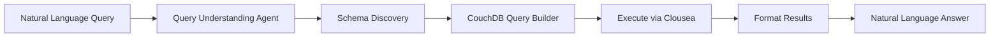
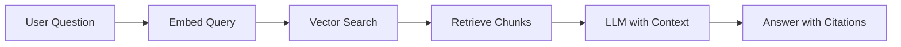
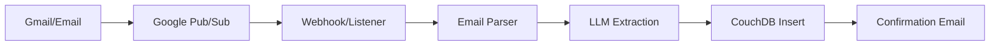
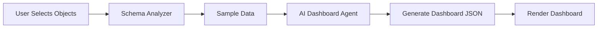
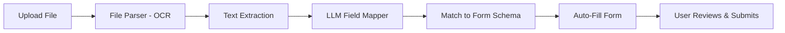
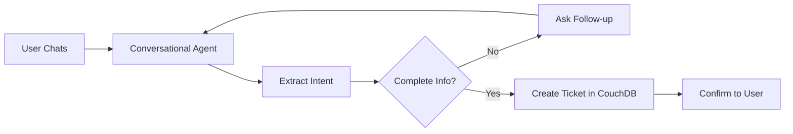
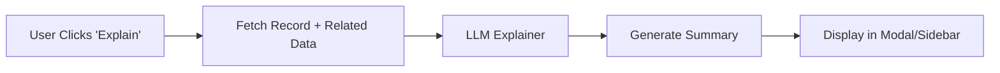

# SAB Platform - Final 7 Kodivian Use Cases
## Complete Implementation Plan

**Platform**: SAB Dynamic App Generation Platform  
**Data Layer**: CouchDB (application data) + Clousea (search indexes) + PostgreSQL (config)  
**AI Platform**: Kodivian  

---

## 🎯 Executive Summary

This document outlines the implementation strategy for 7 AI-powered features that make SAB Platform universally intelligent across all generated applications (ERP, CRM, HR, Support, etc.).

### Use Cases Overview

| # | Use Case | Primary Tech | Complexity | Time | Priority |
|---|----------|--------------|------------|------|----------|
| 1 | Structured Data (NLQ) | LLM + CouchDB | Low | 2 weeks | ⭐⭐⭐ |
| 2 | Document RAG | Embeddings + Vector DB | Medium | 3 weeks | ⭐⭐ |
| 3 | Mail-to-Object | Google Pub/Sub + LLM | Medium | 3 weeks | ⭐⭐⭐ |
| 4 | Dashboard Builder | LLM + Agent | High | 4 weeks | ⭐⭐ |
| 5 | Form Auto-Fill from Files | OCR + LLM | Medium | 2 weeks | ⭐⭐⭐ |
| 6 | Ticket Chat Assistant | Conversational Agent | Low | 2 weeks | ⭐⭐⭐ |
| 7 | Explain Record | LLM | Low | 1 week | ⭐⭐⭐ |

**Total Timeline**: 17 weeks (4-5 months)  
**Recommended Order**: 1 → 7 → 6 → 5 → 3 → 2 → 4

---

## Use Case 1: Structured Data Query (Natural Language to CouchDB)

### Overview
Users ask questions in plain English, system converts to CouchDB queries and returns data.

**Example**:
- User: "Show me employees from appM department"
- System: Executes `CouchDB query WHERE department = 'appM'`
- Returns: List of matching employee records

### Architecture



### Technical Implementation

#### 1. CouchDB Service Layer

**File**: `/packages/server/src/services/couchdb/query-service.ts`

```typescript
export class CouchDBQueryService {
  private nano: any
  private schemaCache: Map<string, any> = new Map()

  // Get database for app
  getDB(orgId: number, appName: string): string {
    return `org_${orgId}_${appName}`
  }

  // Execute Clousea search
  async search(dbName: string, query: string, filters?: any): Promise<any> {
    const db = this.nano.use(dbName)
    const searchQuery = {
      q: query,
      include_docs: true,
      ...filters
    }
    
    const result = await db.search('search', 'index', searchQuery)
    return result.rows.map(r => r.doc)
  }

  // Get schema for app (cached)
  async getSchema(dbName: string): Promise<any> {
    if (this.schemaCache.has(dbName)) {
      return this.schemaCache.get(dbName)
    }

    // Sample documents to infer schema
    const db = this.nano.use(dbName)
    const samples = await db.list({ limit: 100, include_docs: true })
    
    const schema = await this.analyzeSchema(samples.rows.map(r => r.doc))
    this.schemaCache.set(dbName, schema)
    
    return schema
  }

  // Use LLM to analyze document structure
  private async analyzeSchema(documents: any[]): Promise<any> {
    // Group documents by type
    const grouped = this.groupByType(documents)
    
    const schema = {}
    for (const [type, docs] of Object.entries(grouped)) {
      schema[type] = {
        fields: this.extractFields(docs),
        searchable: this.identifySearchableFields(docs),
        filterable: this.identifyFilterableFields(docs)
      }
    }
    
    return schema
  }
}
```

#### 2. Natural Language Query Agent

**Chatflow**: "Structured Data Query Assistant"

**Nodes**:

1. **Query Understanding Node** (LLM Agent with Tools)
   - System Prompt:
   ```
   You are a data query assistant for ${appName} (a ${appType} application).
   
   User asks questions about data. Your job:
   1. Understand what they're looking for
   2. Identify filters (department, date range, status, etc.)
   3. Build CouchDB/Clousea query
   4. Execute and return results
   
   Available Schema:
   ${schema}
   
   Available Tools:
   - get_schema(app_name): Get document types and fields
   - build_search_query(filters): Build Clousea search query
   - execute_query(query): Run query and get results
   - format_results(data): Format for display
   ```

2. **Tools Definition**:
   ```typescript
   const tools = [
     {
       name: 'get_schema',
       description: 'Get database schema for an app',
       parameters: {
         type: 'object',
         properties: {
           app_name: { type: 'string' }
         }
       },
       function: async (args) => {
         return await couchdbService.getSchema(
           couchdbService.getDB(orgId, args.app_name)
         )
       }
     },
     {
       name: 'build_search_query',
       description: 'Build Clousea search query from filters',
       parameters: {
         type: 'object',
         properties: {
           doc_type: { type: 'string' },
           filters: { type: 'object' }
         }
       },
       function: async (args) => {
         // Convert natural language filters to Clousea query
         const queryParts = []
         
         if (args.filters.department) {
           queryParts.push(`department:${args.filters.department}`)
         }
         if (args.filters.status) {
           queryParts.push(`status:${args.filters.status}`)
         }
         if (args.filters.date_range) {
           queryParts.push(`created:[${args.filters.date_range.start} TO ${args.filters.date_range.end}]`)
         }
         
         return queryParts.join(' AND ')
       }
     },
     {
       name: 'execute_query',
       description: 'Execute search query on CouchDB',
       parameters: {
         type: 'object',
         properties: {
           app_name: { type: 'string' },
           query: { type: 'string' },
           limit: { type: 'number' }
         }
       },
       function: async (args) => {
         const dbName = couchdbService.getDB(orgId, args.app_name)
         return await couchdbService.search(dbName, args.query, {
           limit: args.limit || 50
         })
       }
     }
   ]
   ```

3. **Result Formatter**
   - Convert documents to readable format
   - Add metadata (count, filters applied)
   - Generate summary

**Example Conversation**:
```
User: "Show me employees from appM department"

Agent Thinking:
1. Call get_schema('hr_app')
2. Identify: looking for employee documents, filter by department
3. Call build_search_query({ doc_type: 'employee', filters: { department: 'appM' }})
4. Call execute_query(query)
5. Format results

Response:
"Found 12 employees in the appM department:
1. Rajesh Kumar - Senior Developer
2. Priya Sharma - QA Engineer
...

[View All] [Export to Excel] [Refine Search]"
```

### API Endpoints

**New Routes**: `/packages/server/src/routes/nlq.ts`

```typescript
// Query endpoint
router.post('/api/v1/nlq/query', async (req, res) => {
  const { query, appName, userId, orgId } = req.body
  
  // Execute chatflow
  const result = await executeNLQChatflow({
    query,
    appName,
    userId,
    orgId
  })
  
  res.json(result)
})

// Schema endpoint (for autocomplete)
router.get('/api/v1/nlq/schema/:appName', async (req, res) => {
  const { appName } = req.params
  const { orgId } = req.user
  
  const schema = await couchdbService.getSchema(
    couchdbService.getDB(orgId, appName)
  )
  
  res.json(schema)
})
```

### Frontend Integration

**Component**: `<NLQueryBar>`

```jsx
function NLQueryBar({ appName }) {
  const [query, setQuery] = useState('')
  const [loading, setLoading] = useState(false)
  const [results, setResults] = useState(null)
  
  const handleSearch = async () => {
    setLoading(true)
    
    const response = await fetch('/api/v1/nlq/query', {
      method: 'POST',
      headers: { 'Content-Type': 'application/json' },
      body: JSON.stringify({ query, appName })
    })
    
    const data = await response.json()
    setResults(data)
    setLoading(false)
  }
  
  return (
    <div className="nlq-search-bar">
      <input
        type="text"
        placeholder="Ask a question about your data..."
        value={query}
        onChange={(e) => setQuery(e.target.value)}
        onKeyPress={(e) => e.key === 'Enter' && handleSearch()}
      />
      <button onClick={handleSearch} disabled={loading}>
        {loading ? 'Searching...' : 'Ask'}
      </button>
      
      {results && (
        <ResultsPanel results={results} />
      )}
    </div>
  )
}
```

---

## Use Case 2: Document RAG (Vector Search for PDFs/Manuals)

### Overview
Users ask questions about documents (policies, manuals, PDFs), AI retrieves relevant sections and generates answers.

**Example**:
- User: "What is the rule for casual leave in the HR policy PDF?"
- System: Searches embedded PDF chunks → Returns answer from relevant sections

### Architecture



### Technical Implementation

#### 1. Document Store Setup

**Create Document Store**: "SAB_Policy_Documents"

**Configuration**:
- **Embedding**: Google Generative AI Embeddings
- **Vector Store**: Milvus (local) or Pinecone (cloud)
- **Chunk Size**: 1000 tokens
- **Overlap**: 200 tokens
- **Metadata**: document_name, document_type, page_number, app_name

#### 2. Document Ingestion Agentflow

**Agentflow**: "PDF Document Processor"

**Trigger**: File upload to SAB system

**Nodes**:
1. **PDF Loader** - Extract text from PDF
2. **Text Splitter** - Chunk into 1000-token segments
3. **Metadata Enricher** - Add document info
4. **Embedder** - Generate vectors
5. **Vector Store Upsert** - Save to Milvus/Pinecone

**Code**:
```typescript
// Upload endpoint
router.post('/api/v1/documents/upload', upload.single('file'), async (req, res) => {
  const { file } = req
  const { appName, documentType } = req.body
  const { orgId, userId } = req.user
  
  // Trigger agentflow
  await upsertQueue.add('document-ingestion', {
    filePath: file.path,
    fileName: file.originalname,
    documentType,
    appName,
    orgId,
    userId
  })
  
  res.json({ message: 'Document processing started', fileId: file.filename })
})
```

#### 3. Document Query Chatflow

**Chatflow**: "Document Q&A Assistant"

**Nodes**:
1. **Document Store Retrieval**
   - Store: SAB_Policy_Documents
   - Top K: 5 chunks
   - Metadata filter: `app_name = ${currentApp}`

2. **Conversational Retrieval Chain**
   - LLM: Google Gemini 1.5 Pro
   - Memory: Buffer Memory (for follow-ups)
   - System Prompt:
   ```
   You are a helpful assistant for ${appName} documentation.
   Answer questions based ONLY on the provided context from documents.
   
   If the answer is not in the context, say "I don't have information about that in the available documents."
   
   Always cite the document name and page when providing answers.
   
   Context: ${retrievedChunks}
   ```

3. **Citation Formatter**
   - Extract document names and pages from metadata
   - Format as: "According to HR_Policy.pdf (page 5)..."

**Example Interaction**:
```
User: "What is the rule for casual leave?"

System:
1. Embed query
2. Search vector store (filter: app='hr_app')
3. Retrieve top 5 chunks:
   - HR_Policy.pdf, page 5: "Casual leave policy... 12 days per year..."
   - HR_Policy.pdf, page 6: "Leave application process..."
4. LLM generates answer

Response:
"According to the HR Policy (page 5), employees are entitled to 12 days of casual leave per year. Casual leave can be taken for personal emergencies and does not require prior approval for single-day leaves. For consecutive leaves, manager approval is required.

Source: HR_Policy.pdf, pages 5-6"
```

### Advanced Features

**Multi-Document Search**: Search across multiple document types
**Hybrid Search**: Combine vector + keyword search
**Document Version Control**: Track policy updates
**Source Preview**: Show original PDF page in sidebar

---

## Use Case 3: Mail-to-Object (Google Pub/Sub → CouchDB)

### Overview
Automatically parse emails and create appropriate SAB objects (tickets, leads, complaints).

**Example**:
- Email: "Water purifier not working. Please send engineer."
- System: Creates Ticket object in CouchDB

### Architecture



### Technical Implementation

#### 1. Google Pub/Sub Setup

**Prerequisites**:
- Google Cloud Project
- Enable Gmail API
- Create Pub/Sub topic: `sab-email-notifications`
- Set up push subscription → `https://your-domain/api/v1/email/webhook`

**Gmail Watch Setup**:
```typescript
// Setup Gmail watch (run once or refresh every 7 days)
async function setupGmailWatch(userEmail: string) {
  const gmail = google.gmail({ version: 'v1', auth })
  
  await gmail.users.watch({
    userId: 'me',
    requestBody: {
      topicName: 'projects/YOUR_PROJECT/topics/sab-email-notifications',
      labelIds: ['INBOX']
    }
  })
}
```

#### 2. Webhook Handler

**Route**: `/packages/server/src/routes/email-webhook.ts`

```typescript
router.post('/api/v1/email/webhook', async (req, res) => {
  // Google Pub/Sub sends POST with notification
  const message = req.body.message
  const data = Buffer.from(message.data, 'base64').toString()
  
  const notification = JSON.parse(data)
  const { emailAddress, historyId } = notification
  
  // Fetch new emails since historyId
  const emails = await fetchNewEmails(emailAddress, historyId)
  
  // Process each email
  for (const email of emails) {
    await processEmail(email)
  }
  
  res.status(200).send('OK')
})

async function processEmail(email: any) {
  const { from, subject, body, attachments } = email
  
  // Determine orgId from recipient email or domain
  const orgId = await getOrgIdFromEmail(email.to)
  
  // Add to processing queue
  await emailQueue.add('process-email', {
    from,
    subject,
    body,
    attachments,
    orgId
  })
}
```

#### 3. Email Processing Agentflow

**Agentflow**: "Email to Object Converter"

**Trigger**: Queue job

**Nodes**:

1. **Email Parser**
   ```typescript
   {
     type: 'function',
     name: 'parseEmail',
     code: `
       const { subject, body, from } = inputData
       
       // Clean HTML
       const plainText = stripHtml(body)
       
       return {
         subject,
         body: plainText,
         senderEmail: from,
         senderName: extractName(from)
       }
     `
   }
   ```

2. **App Type Detector** (LLM)
   ```
   Prompt:
   Email Subject: ${subject}
   Email Body: ${body}
   Sender: ${from}
   
   Available Apps in this Organization:
   - Support (for complaints, issues, service requests)
   - Sales (for product inquiries, quotes, orders)
   - HR (for job applications, employee queries)
   
   Which app should handle this email?
   Return JSON: { "appName": "support", "confidence": 0.95, "reason": "..." }
   ```

3. **Extraction Agent** (Agent with Tools)
   - Get app schema
   - Extract structured data from email
   - Validate required fields
   
   ```
   System Prompt:
   Extract data from this email to create a ${objectType} record.
   
   Email: ${email}
   Schema: ${schema}
   
   Extract all relevant fields. Use these tools:
   - get_customer_by_email(email): Find existing customer
   - validate_phone(phone): Check phone format
   - categorize_issue(description): Determine issue category
   
   Return complete JSON document.
   ```

4. **CouchDB Insert**
   ```typescript
   const db = nano.use(couchdbService.getDB(orgId, appName))
   
   const doc = {
     _id: generateId(),
     type: objectType,
     ...extractedData,
     source: 'email',
     email_id: email.messageId,
     created_at: new Date().toISOString(),
     status: 'new'
   }
   
   await db.insert(doc)
   ```

5. **Confirmation Email**
   ```typescript
   await sendEmail({
     to: email.from,
     subject: `Re: ${email.subject} - Ticket #${doc._id}`,
     body: `
       Thank you for contacting us.
       
       Your ticket has been created: #${doc._id}
       Category: ${doc.category}
       Priority: ${doc.priority}
       
       We will respond within 24 hours.
       
       Track your ticket: ${getFrontendUrl()}/tickets/${doc._id}
     `
   })
   ```

**Example Flow**:
```
Input Email:
From: customer@example.com
Subject: Water purifier issue
Body: "My water purifier is not working. Getting error E03. Please send an engineer to my address: 123 Main St."

Processing:
1. Detect app: "Support" (92% confidence)
2. Get Support app schema: Ticket object
3. Extract:
   {
     customer_email: "customer@example.com",
     issue_type: "Equipment Malfunction",
     description: "Water purifier not working, error E03",
     priority: "High",
     category: "field_service",
     address: "123 Main St"
   }
4. Create ticket in CouchDB
5. Send confirmation email with ticket #

Output:
Ticket #TKT-2024-001 created successfully
```

---

## Use Case 4: Intelligent Dashboard Builder

### Overview
Select SAB objects, AI auto-generates dashboard with relevant charts and KPIs.

**Example**:
- User: Selects "Employee" + "Leave" objects
- System: Generates dashboard with leave balance charts, department breakdown, trends

### Architecture



### Implementation

#### 1. Dashboard Builder UI

**Component**: `<DashboardDesigner>`

```jsx
function DashboardDesigner() {
  const [selectedObjects, setSelectedObjects] = useState([])
  const [generating, setGenerating] = useState(false)
  const [dashboard, setDashboard] = useState(null)
  
  const availableObjects = useAppObjects() // Fetch from schema
  
  const generateDashboard = async () => {
    setGenerating(true)
    
    const response = await fetch('/api/v1/dashboards/generate', {
      method: 'POST',
      headers: { 'Content-Type': 'application/json' },
      body: JSON.stringify({
        objects: selectedObjects,
        appName: currentApp
      })
    })
    
    const dashboardConfig = await response.json()
    setDashboard(dashboardConfig)
    setGenerating(false)
  }
  
  return (
    <div>
      <ObjectSelector
        objects={availableObjects}
        selected={selectedObjects}
        onChange={setSelectedObjects}
      />
      
      <button onClick={generateDashboard} disabled={generating}>
        {generating ? 'Generating...' : 'Generate Dashboard'}
      </button>
      
      {dashboard && (
        <DashboardPreview config={dashboard} />
      )}
    </div>
  )
}
```

#### 2. Dashboard Generation Agent

**Agentflow**: "Dashboard Intelligence Generator"

**Nodes**:

1. **Schema Loader**
   - Get metadata for selected objects
   - Field types, relationships, cardinality

2. **Data Sampler**
   - Fetch 1000 recent documents per object
   - Calculate statistics

3. **Dashboard Designer Agent** (LLM with Tools)
   
   ```
   System Prompt:
   You are an expert dashboard designer. Generate a dashboard for these business objects.
   
   Selected Objects: ${objects}
   Schemas: ${schemas}
   Sample Data: ${samples}
   
   Create a dashboard with:
   1. **KPI Cards** - Key metrics (counts, sums, averages)
   2. **Trend Charts** - Time-series data
   3. **Distribution Charts** - Category breakdowns
   4. **Tables** - Detailed records
   5. **Relationships** - Cross-object insights
   
   For each widget, specify:
   - type: 'kpi' | 'line' | 'bar' | 'pie' | 'table' | 'heatmap'
   - title: Display title
   - query: CouchDB query (MapReduce or search)
   - visualization: Chart config
   
   Return dashboard JSON.
   
   Tools available:
   - analyze_field(object, field): Get field statistics
   - suggest_kpi(object): Recommend key metrics
   - detect_time_field(object): Find date/time fields
   - find_relationships(objects): Identify connections
   ```

4. **Query Generator**
   - Convert widget specs to CouchDB queries
   
   ```typescript
   // Example: Total employees KPI
   {
     widget: {
       type: 'kpi',
       title: 'Total Employees'
     },
     query: {
       map: "function(doc) { if(doc.type === 'employee') emit(null, 1) }",
       reduce: "_count"
     }
   }
   
   // Example: Leave by department
   {
     widget: {
       type: 'bar',
       title: 'Leave Requests by Department'
     },
     query: {
       map: "function(doc) { if(doc.type === 'leave') emit(doc.department, 1) }",
       reduce: "_count",
       group: true
     }
   }
   ```

5. **Dashboard JSON Generator**
   
   ```json
   {
     "id": "dash_emp_leave_001",
     "name": "Employee & Leave Overview",
     "objects": ["employee", "leave"],
     "layout": "grid",
     "widgets": [
       {
         "id": "kpi_total_emp",
         "type": "kpi",
         "title": "Total Employees",
         "position": { "x": 0, "y": 0, "w": 3, "h": 2 },
         "query": "...",
         "icon": "users"
       },
       {
         "id": "chart_leave_trend",
         "type": "line",
         "title": "Leave Requests (Last 6 Months)",
         "position": { "x": 3, "y": 0, "w": 9, "h": 4 },
         "query": "...",
         "xAxis": "month",
         "yAxis": "count"
       }
     ],
     "refresh_interval": 300
   }
   ```

6. **Dashboard Saver**
   - Save to CouchDB: `dashboard_configs` database
   - Associate with user/org

#### 3. Dashboard Renderer

**Component**: `<AutoDashboard>`

```jsx
function AutoDashboard({ dashboardId }) {
  const [config, loading] = useDashboard(dashboardId)
  const [data, setData] = useState({})
  
  useEffect(() => {
    if (!config) return
    
    // Execute all queries in parallel
    const promises = config.widgets.map(widget =>
      executeQuery(widget.query).then(result => ({
        id: widget.id,
        data: result
      }))
    )
    
    Promise.all(promises).then(results => {
      const dataMap = {}
      results.forEach(r => dataMap[r.id] = r.data)
      setData(dataMap)
    })
  }, [config])
  
  if (loading) return <Spinner />
  
  return (
    <DashboardGrid layout={config.layout}>
      {config.widgets.map(widget => (
        <Widget
          key={widget.id}
          type={widget.type}
          title={widget.title}
          data={data[widget.id]}
          config={widget}
        />
      ))}
    </DashboardGrid>
  )
}
```

---

## Use Case 5: Form Auto-Fill from Files (PDF/Image → Structured Data)

### Overview
Upload a document (PDF, image, scan), AI extracts data and auto-fills form fields.

**Example**:
- User: Uploads invoice PDF to "Create Purchase Order" form
- System: Extracts vendor name, items, amounts → Pre-fills form

### Architecture



### Implementation

#### 1. File Upload with Auto-Fill

**UI Component**: `<SmartFormUpload>`

```jsx
function SmartFormUpload({ formSchema, onAutoFill }) {
  const [uploading, setUploading] = useState(false)
  
  const handleFileUpload = async (file) => {
    setUploading(true)
    
    const formData = new FormData()
    formData.append('file', file)
    formData.append('objectType', formSchema.objectType)
    formData.append('schema', JSON.stringify(formSchema))
    
    const response = await fetch('/api/v1/forms/autofill', {
      method: 'POST',
      body: formData
    })
    
    const extracted = await response.json()
    onAutoFill(extracted.fields)
    
    setUploading(false)
  }
  
  return (
    <div className="smart-upload">
      <input
        type="file"
        accept=".pdf,.png,.jpg,.jpeg,.doc,.docx"
        onChange={(e) => handleFileUpload(e.target.files[0])}
      />
      {uploading && <Spinner text="Extracting data from file..." />}
    </div>
  )
}
```

#### 2. File Processing Service

**Service**: `/packages/server/src/services/file-processor.ts`

```typescript
export class FileProcessorService {
  // Extract text from various file types
  async extractText(filePath: string, fileType: string): Promise<string> {
    switch (fileType) {
      case 'pdf':
        return await this.extractFromPDF(filePath)
      case 'image':
        return await this.ocrImage(filePath)
      case 'doc':
      case 'docx':
        return await this.extractFromWord(filePath)
      default:
        throw new Error(`Unsupported file type: ${fileType}`)
    }
  }
  
  // PDF extraction
  private async extractFromPDF(filePath: string): Promise<string> {
    const pdf = await pdfParse(fs.readFileSync(filePath))
    return pdf.text
  }
  
  // OCR for images
  private async ocrImage(filePath: string): Promise<string> {
    // Use Google Vision API or Tesseract
    const vision = require('@google-cloud/vision')
    const client = new vision.ImageAnnotatorClient()
    
    const [result] = await client.textDetection(filePath)
    const detections = result.textAnnotations
    
    return detections[0]?.description || ''
  }
}
```

#### 3. AI Field Extraction Agent

**Agentflow**: "Smart Form Filler"

**Nodes**:

1. **File Parser** - Extract text from file

2. **Field Mapper Agent** (LLM)
   
   ```
   System Prompt:
   Extract structured data from the document text to fill a form.
   
   Document Text: ${extractedText}
   
   Form Schema:
   ${JSON.stringify(formSchema)}
   
   Required Fields: ${requiredFields}
   Optional Fields: ${optionalFields}
   
   Extract values for as many fields as possible.
   
   Guidelines:
   - For dates: convert to YYYY-MM-DD format
   - For amounts: extract numbers only (remove currency symbols)
   - For phone: extract and format as XXX-XXX-XXXX
   - For email: validate format
   - If field not found in document, return null
   
   Return JSON matching form schema.
   ```

3. **Validation Node**
   - Validate extracted data against field types
   - Check required fields
   - Format conversions

4. **Confidence Scorer**
   ```typescript
   // Calculate confidence for each field
   function scoreExtraction(extracted, originalText) {
     const scores = {}
     
     for (const [field, value] of Object.entries(extracted)) {
       if (value === null) {
         scores[field] = 0
       } else if (originalText.includes(value)) {
         scores[field] = 0.95 // Found exact match
       } else {
         scores[field] = 0.6 // Inferred/transformed
       }
     }
     
     return scores
   }
   ```

5. **Response Formatter**
   ```json
   {
     "extracted_fields": {
       "vendor_name": "ABC Suppliers Ltd",
       "invoice_number": "INV-2024-001",
       "invoice_date": "2024-11-28",
       "total_amount": 15000.00,
       "items": [
         { "description": "Widget A", "quantity": 10, "price": 1000 },
         { "description": "Widget B", "quantity": 5, "price": 1000 }
       ]
     },
     "confidence_scores": {
       "vendor_name": 0.95,
       "invoice_number": 0.95,
       "invoice_date": 0.90,
       "total_amount": 0.95,
       "items": 0.85
     },
     "needs_review": ["items"]
   }
   ```

**Example Usage**:

```
User: Creating purchase order, uploads invoice PDF

Extracted Text (from PDF):
"ABC Suppliers Ltd
Invoice #: INV-2024-001
Date: Nov 28, 2024
Items:
- Widget A x 10 @ ₹1,000 = ₹10,000
- Widget B x 5 @ ₹1,000 = ₹5,000
Total: ₹15,000"

Form Auto-Fill:
- Vendor: "ABC Suppliers Ltd" ✓ (95% confidence)
- Invoice Number: "INV-2024-001" ✓ (95%)
- Date: 2024-11-28 ✓ (90%)
- Amount: 15000.00 ✓ (95%)
- Items: [parsed line items] ⚠️ (85% - review)

User Reviews → Corrects items if needed → Submits
```

---

## Use Case 6: Ticket Raising Assistant (Chat-to-Ticket)

### Overview
Users chat with AI to create tickets naturally, without filling forms.

**Example**:
- User: "My laptop is not turning on"
- Bot: "I'll help you raise an IT support ticket. What's your location?"
- User: "Chennai office, 3rd floor"
- Bot: "Got it. Creating ticket... Ticket #IT-2024-123 created!"

### Architecture



### Implementation

#### 1. Chat UI

**Component**: `<TicketChatAssistant>`

```jsx
function TicketChatAssistant() {
  const [messages, setMessages] = useState([{
    role: 'assistant',
    content: 'Hi! I can help you raise a ticket. What issue are you facing?'
  }])
  const [input, setInput] = useState('')
  
  const sendMessage = async () => {
    const newMessages = [...messages, { role: 'user', content: input }]
    setMessages(newMessages)
    setInput('')
    
    // Call chatflow
    const response = await fetch('/api/v1/chat/ticket-assistant', {
      method: 'POST',
      headers: { 'Content-Type': 'application/json' },
      body: JSON.stringify({ messages: newMessages })
    })
    
    const { reply, ticket } = await response.json()
    
    setMessages([...newMessages, { role: 'assistant', content: reply, ticket }])
  }
  
  return (
    <ChatInterface
      messages={messages}
      input={input}
      onInputChange={setInput}
      onSend={sendMessage}
    />
  )
}
```

#### 2. Ticket Assistant Chatflow

**Chatflow**: "Ticket Creation Assistant"

**Nodes**:

1. **Conversational Agent** (OpenAI Agent or Gemini)
   
   ```
   System Prompt:
   You are a friendly support assistant helping users create tickets.
   
   Your goal: Collect all required information to create a ticket.
   
   Required Fields:
   - issue_description: What's the problem?
   - category: IT / HR / Facilities / Admin
   - priority: Low / Medium / High / Critical
   - location: User's location (if applicable)
   
   Optional Fields:
   - affected_users: How many people affected?
   - attachments: Screenshots or files
   
   Process:
   1. Understand the issue from user's first message
   2. Auto-detect category if possible
   3. Auto-detect priority (urgent words → high priority)
   4. Ask for missing required fields
   5. When complete, confirm and create ticket
   
   Be conversational, helpful, and efficient.
   
   Tools available:
   - get_user_profile(): Get user's department, location
   - create_ticket(data): Create ticket in system
   - upload_attachment(file): Handle file uploads
   ```

2. **State Management** (Memory)
   - Track collected fields
   - Remember context across messages

3. **Validation Tool**
   ```typescript
   {
     name: 'validate_ticket_data',
     description: 'Check if we have all required fields',
     function: (collectedData) => {
       const required = ['issue_description', 'category', 'priority']
       const missing = required.filter(f => !collectedData[f])
       
       return {
         complete: missing.length === 0,
         missing_fields: missing
       }
     }
   }
   ```

4. **Ticket Creation Tool**
   ```typescript
   {
     name: 'create_ticket',
     description: 'Create ticket in CouchDB',
     function: async (ticketData) => {
       const db = nano.use(couchdbService.getDB(orgId, 'support'))
       
       const ticket = {
         _id: generateTicketId(),
         type: 'ticket',
         ...ticketData,
         status: 'new',
         created_at: new Date().toISOString(),
         created_by: userId,
         source: 'chat_assistant'
       }
       
       await db.insert(ticket)
       
       return {
         ticket_id: ticket._id,
         message: `Ticket ${ticket._id} created successfully!`
       }
     }
   }
   ```

**Example Conversation**:

```
User: "My laptop is not turning on"

Agent:
- Detects: IT issue, likely hardware
- Auto-fills: category = "IT", priority = "High"
- Missing: location

Bot: "I'll create an IT support ticket for you. Just to confirm - what's your current location?"

User: "Chennai office, 3rd floor"

Agent:
- Collected: description, category, priority, location
- Validation: Complete ✓

Bot: "Got it! Creating your ticket now...

✅ Ticket Created: #IT-2024-123

Issue: Laptop not turning on
Priority: High
Location: Chennai Office, 3rd Floor
Assigned to: IT Support Team

You'll receive updates via email. Average response time: 2 hours.

Need anything else?"
```

---

## Use Case 7: "Explain This Record" Assistant

### Overview
Click any record, AI explains it in simple, human-friendly language.

**Example**:
- Record: Purchase Order #PO-2024-456
- User clicks: "Explain this"
- AI: "This purchase order for ₹18,500 was created by Prabu on Nov 10..."

### Architecture



### Implementation

#### 1. Explain Button UI

**Component**: Add to record detail pages

```jsx
function RecordDetailPage({ recordId, objectType }) {
  const [record, setRecord] = useState(null)
  const [explanation, setExplanation] = useState(null)
  const [explaining, setExplaining] = useState(false)
  
  const explainRecord = async () => {
    setExplaining(true)
    
    const response = await fetch('/api/v1/records/explain', {
      method: 'POST',
      headers: { 'Content-Type': 'application/json' },
      body: JSON.stringify({ recordId, objectType })
    })
    
    const { explanation } = await response.json()
    setExplanation(explanation)
    setExplaining(false)
  }
  
  return (
    <div>
      <RecordHeader record={record} />
      
      <button onClick={explainRecord} className="explain-btn">
        {explaining ? 'Explaining...' : '🤖 Explain This Record'}
      </button>
      
      {explanation && (
        <ExplanationPanel explanation={explanation} />
      )}
      
      <RecordDetails record={record} />
    </div>
  )
}
```

#### 2. Record Explainer Service

**Route**: `/packages/server/src/routes/record-explainer.ts`

```typescript
router.post('/api/v1/records/explain', async (req, res) => {
  const { recordId, objectType } = req.body
  const { orgId, userId } = req.user
  
  // Fetch record from CouchDB
  const db = nano.use(couchdbService.getDB(orgId, currentApp))
  const record = await db.get(recordId)
  
  // Fetch related records
  const relatedData = await fetchRelatedRecords(record, objectType)
  
  // Get change history
  const history = await getRecordHistory(recordId)
  
  // Generate explanation
  const explanation = await explainRecord({
    record,
    objectType,
    relatedData,
    history
  })
  
  res.json({ explanation })
})
```

#### 3. AI Explainer Function

```typescript
async function explainRecord(context: {
  record: any
  objectType: string
  relatedData: any
  history: any[]
}): Promise<string> {
  const { record, objectType, relatedData, history } = context
  
  const llm = new ChatGoogleGenerativeAI({
    modelName: 'gemini-1.5-pro',
    temperature: 0.3
  })
  
  const prompt = `
You are explaining a business record to a non-technical user.

Record Type: ${objectType}
Record Data: ${JSON.stringify(record, null, 2)}

Related Information:
${JSON.stringify(relatedData, null, 2)}

Change History:
${history.map(h => `- ${h.date}: ${h.change}`).join('\n')}

Generate a simple, friendly explanation that:
1. Summarizes what this record is
2. Highlights key information (amounts, dates, people, status)
3. Explains current status and what happens next
4. Mentions any pending actions or issues
5. Uses plain language (avoid technical jargon)

Keep it concise (3-4 sentences).
`
  
  const response = await llm.invoke(prompt)
  return response.content
}
```

**Fetch Related Data**:

```typescript
async function fetchRelatedRecords(record: any, objectType: string): Promise<any> {
  const related = {}
  
  // Example: For Purchase Order, fetch vendor, items, approvals
  if (objectType === 'purchase_order') {
    if (record.vendor_id) {
      related.vendor = await db.get(record.vendor_id)
    }
    
    if (record.approver_id) {
      related.approver = await db.get(record.approver_id)
    }
    
    // Get approval history
    related.approvals = await db.view('approvals', 'by_po', {
      key: record._id
    })
  }
  
  // Example: For Ticket, fetch assigned user, customer
  if (objectType === 'ticket') {
    if (record.assigned_to) {
      related.assigned_user = await db.get(record.assigned_to)
    }
    
    if (record.customer_id) {
      related.customer = await db.get(record.customer_id)
    }
    
    // Get comment history
    related.comments = await db.view('comments', 'by_ticket', {
      key: record._id
    })
  }
  
  return related
}
```

**Example Output**:

```
Record: Purchase Order #PO-2024-456

Explanation:
"This purchase order for ₹18,500 was created by Prabu Kumar on November 10, 2024, requesting office supplies from ABC Vendors. It's currently awaiting approval from the Finance Manager (Priya Sharma). The order was last updated 2 days ago when the vendor confirmed availability of all items. Once approved, it will proceed to procurement for processing."

Key Details:
• Amount: ₹18,500
• Status: Pending Approval
• Created: Nov 10, 2024 (3 days ago)
• Next Step: Finance Manager review
• Vendor: ABC Vendors (confirmed)

Timeline:
Nov 10: Created by Prabu
Nov 11: Vendor confirmed availability
Nov 12: Forwarded to Finance
→ Waiting: Manager approval
```

---

## Implementation Roadmap

### Phase 1: Foundation (Weeks 1-3)

**Week 1**: Infrastructure Setup
- [x] CouchDB query service wrapper
- [ ] Schema discovery and caching
- [ ] Clousea search integration
- [ ] Base LLM agent framework
- [ ] Queue setup for async processing

**Week 2-3**: Use Case 7 + Use Case 1
- [ ] **UC7**: Record Explainer (simplest, 1 week)
  - API endpoint
  - LLM explainer function
  - UI integration
- [ ] **UC1**: Natural Language Query (2 weeks)
  - Query understanding agent
  - CouchDB query builder
  - Frontend query bar

### Phase 2: High-Value Features (Weeks 4-8)

**Week 4-5**: Use Case 6
- [ ] Ticket chat assistant chatflow
- [ ] State management for conversation
- [ ] Ticket creation tools
- [ ] Chat UI component

**Week 6-7**: Use Case 5
- [ ] File upload handling
- [ ] OCR/PDF text extraction
- [ ] Field mapping agent
- [ ] Form auto-fill UI

**Week 8**: Use Case 3
- [ ] Google Pub/Sub setup
- [ ] Email webhook handler
- [ ] Email processing agentflow
- [ ] Confirmation email system

### Phase 3: Advanced Features (Weeks 9-14)

**Week 9-11**: Use Case 2
- [ ] Document store setup (Milvus/Pinecone)
- [ ] PDF ingestion agentflow
- [ ] RAG chatflow
- [ ] Document management UI

**Week 12-14**: Use Case 4
- [ ] Dashboard designer UI
- [ ] Dashboard generation agent
- [ ] Query generator
- [ ] Dashboard renderer component

### Phase 4: Testing & Deployment (Weeks 15-17)

**Week 15-16**: Integration Testing
- [ ] End-to-end testing of all use cases
- [ ] Performance optimization
- [ ] Error handling improvements
- [ ] User acceptance testing

**Week 17**: Documentation & Deployment
- [ ] User documentation
- [ ] API documentation
- [ ] Deployment to production
- [ ] Training materials

---

## Technical Requirements

### Infrastructure

**CouchDB**:
- Existing (application data)
- Clousea enabled for full-text search
- Design documents for common views

**Vector Database** (for Use Case 2 only):
- **Option A**: Milvus (self-hosted, free)
- **Option B**: Pinecone (cloud, $70/month)
- Recommendation: Start with Milvus

**Google Cloud** (for Use Case 3):
- Gmail API enabled
- Pub/Sub topic created
- Service account credentials

**AI/LLM**:
- Google Gemini 1.5 Pro (primary)
- Google Generative AI Embeddings (for UC2)
- API keys and quotas

### Development Dependencies

**Backend** (`package.json`):
```json
{
  "dependencies": {
    "nano": "^10.1.0",
    "@google-cloud/vision": "^4.0.0",
    "@langchain/google-genai": "^0.0.10",
    "pdf-parse": "^1.1.1",
    "mammoth": "^1.6.0",
    "tesseract.js": "^5.0.0",
    "@google-cloud/pubsub": "^4.0.0",
    "milvus": "^2.0.0"
  }
}
```

**Frontend** (`package.json`):
```json
{
  "dependencies": {
    "react-grid-layout": "^1.4.0",
    "recharts": "^2.9.0",
    "react-dropzone": "^14.2.0"
  }
}
```

---

## Cost Estimates

### Monthly Operational Costs (1000 active users)

**AI/LLM** (Google Gemini):
- UC1 (NLQ): ~10K queries/month × $0.00125 = $12.50
- UC2 (RAG): ~5K queries/month × $0.00125 = $6.25
- UC3 (Email): ~2K emails/month × $0.00125 = $2.50
- UC4 (Dashboard): ~500 generations/month × $0.00125 = $0.63
- UC5 (Forms): ~3K uploads/month × $0.00125 = $3.75
- UC6 (Tickets): ~5K conversations/month × $0.00125 = $6.25
- UC7 (Explain): ~8K explanations/month × $0.00125 = $10.00
- **Total LLM**: ~$42/month

**Embeddings** (for UC2):
- Document embedding: ~1M tokens/month × $0.00002 = $20
- Query embedding: ~100K tokens/month × $0.00002 = $2
- **Total Embeddings**: ~$22/month

**Vector Database**:
- Milvus (self-hosted): $0 (uses existing infrastructure)
- Or Pinecone (cloud): $70/month
- **Recommendation**: Milvus = $0

**Google Cloud** (for UC3):
- Gmail API: Free (within quota)
- Pub/Sub: $0.40 per million messages = ~$0.80/month
- **Total GCP**: ~$1/month

**Total Monthly Cost**: ~$65/month (with Milvus)

### Development Effort

| Phase | Duration | Developers | Hours |
|-------|----------|------------|-------|
| Phase 1 (Foundation + UC1, UC7) | 3 weeks | 2 | 240 |
| Phase 2 (UC3, UC5, UC6) | 5 weeks | 2 | 400 |
| Phase 3 (UC2, UC4) | 6 weeks | 2 | 480 |
| Phase 4 (Testing, Deployment) | 3 weeks | 2 | 240 |
| **Total** | **17 weeks** | **2** | **1,360** |

**Timeline**: ~4.5 months with 2 developers

---

## Success Metrics

### Adoption Metrics
- % of users using NLQ (UC1) weekly: Target >60%
- Tickets created via chat (UC6): Target >40% of all tickets
- Forms auto-filled (UC5): Target >50% of manual forms
- Documents queried (UC2): Target 100+ queries/week

### Performance Metrics
- NLQ response time: <3 seconds
- RAG answer quality: >85% relevant
- Email-to-ticket accuracy: >90%
- Dashboard generation time: <30 seconds
- Form auto-fill accuracy: >80%

### Business Impact
- Time saved per user per day: Target 15 minutes
- Manual form entry reduction: Target 60%
- Support ticket creation time: Reduced from 5 min → 1 min
- Data accuracy improvement: Target 30% fewer errors

---

## Risk Mitigation

### Technical Risks

**Risk**: LLM costs exceed budget
- **Mitigation**: Implement caching, rate limiting, usage monitoring

**Risk**: Vector DB performance issues
- **Mitigation**: Start with Milvus locally, evaluate Pinecone if needed

**Risk**: Email parsing accuracy low
- **Mitigation**: Human-in-loop for low confidence, continuous learning

### Business Risks

**Risk**: Low user adoption
- **Mitigation**: Phased rollout, extensive training, in-app guidance

**Risk**: Data privacy concerns
- **Mitigation**: Data encryption, org isolation, GDPR compliance

---

## Next Steps

1. **Review & Approve** this plan
2. **Set up infrastructure** (Week 1)
3. **Start with Phase 1** (UC7 + UC1)
4. **Pilot with 1-2 customers** after Phase 1
5. **Iterate based on feedback**

**Ready to begin implementation?**
